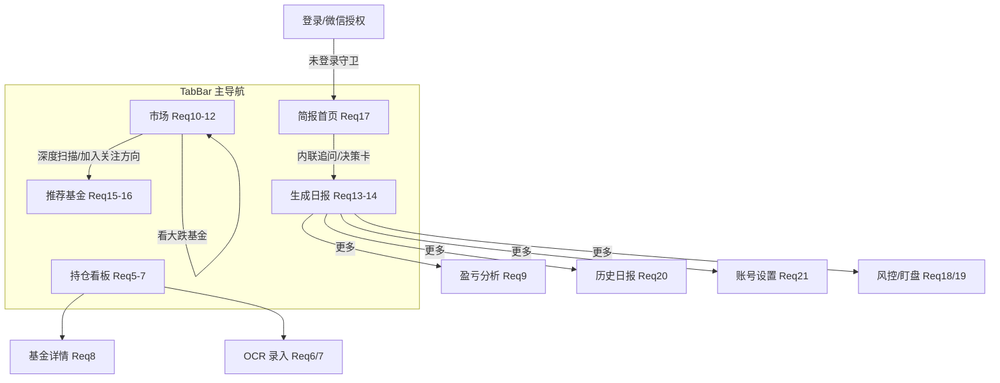
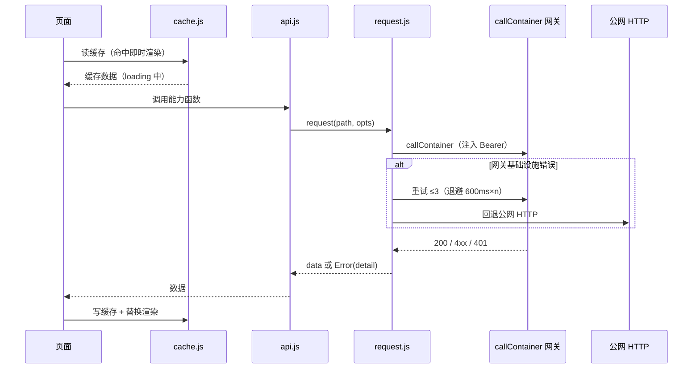
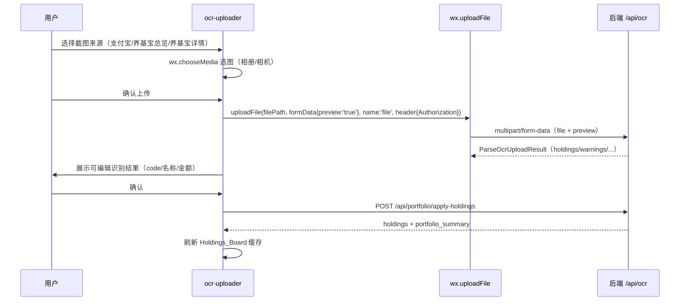

# Design Document

## Overview

本设计描述如何让微信小程序（`apps/miniprogram`，原生 WXML/WXSS/JS）在**功能层面对标** Web 端（Next.js/React）。目标是 **功能等价（Functional_Parity）** 而非逐像素复刻：同一套后端 FastAPI 服务（按 `userId` 共享数据）暴露的全部能力，在小程序里都要可用，但交互用小程序原生方式实现，并在图表、AI 追问流式、文件上传等处接受已确认的平台差异（A1–A8）。

设计遵循 requirements.md 的 21 条需求（7 个阶段）并保持 Requirement 编号可追溯。核心约束：

- **后端原则上不改**（A7）。仅两处后端最小适配，且对 Web 端零影响：
  - **BC1（非流式追问）**：新增**非流式聚合追问端点**，与现有 SSE 端点并存。Web 继续用 SSE，互不影响。
  - **BC2（上传透传）**：现有 `/api/ocr` 与 `/api/transactions/ocr` 已是 `multipart/form-data`（`UploadFile + Form`），`wx.uploadFile` 可直接透传，**无需改后端代码**，仅需验证 `callContainer` 透传可用。
- 复用现有 MVP 已验证的 `utils/api.js` 的 `callContainer + 3 次重试 + HTTP 回退`、`401 清 token 跳登录`、`Bearer` 注入机制，并在其上系统性扩展能力函数。

设计采用**分层架构 + 纯函数抽离**策略：把格式化、状态推导、请求构造等可测逻辑抽到无 `wx.*` 依赖的纯函数模块（`utils/`），便于在 Node 环境用属性测试与单测覆盖；页面/组件层只做渲染与事件绑定。

### Web 能力面映射（对标基线）

`apps/web/src/lib/api.ts` 导出的能力函数即需对标的全集。按域归类（小程序 API 层逐一封装，见 Requirement 2）：

| 域 | Web 函数 | 后端端点 |
|----|----------|----------|
| 鉴权/账号 | `registerUser`/`loginUser`/`fetchCurrentUser`/`bindWechatAccount` + 已有 `wechatLogin`/`linkEmail` | `/api/auth/*` |
| 持仓 | `fetchPortfolioHoldings`/`fetchPortfolioSummary`/`applyPortfolioHoldings`/`refreshSectorQuotes`/`applySectorMapping` | `/api/portfolio/*`、`/api/holdings/*`、`/api/sector-mappings/apply` |
| 持仓明细/图表 | `fetchHoldingDetail`/`fetchSectorIntraday`/`fetchSectorQuotesStatus` | `/api/holdings/detail`、`/api/sector-quotes/*` |
| OCR/交易 | `parseOcrUpload`/`transactionsOcr`/`applyTransactions`/`getFundTransactions` | `/api/ocr`、`/api/transactions/*` |
| 基金档案/净值 | `searchFunds`/`updateFundProfile`/`updateFundProfilePurchaseDate`/`fetchFundNavHistory`/`fetchFundNavHistoryPage` | `/api/funds/search`、`/api/fund-profiles/*` |
| 盈亏分析 | `fetchPortfolioDashboard`/`fetchIndexDailyHistory` | `/api/portfolio/dashboard`、`/api/market/index-daily` |
| 市场 | `fetchMarketThemeBoards`/`fetchDipRadar`/`fetchUsMarketOverview`/`fetchDiscoverySectors`/`fetchSectorLabels` | `/api/market/*`、`/api/fund-discovery/sectors` |
| 日报 | `startAnalyzeJob`/`fetchAnalysisJob`/`previewNewsForHoldings`/`listReports`/`deleteReport`/`fetchReportOutcomes`/`fetchReportWeeklyOutcomes`/`fetchRebalanceSimulation`/`fetchReportMarkdown` | `/api/analyze/async`、`/api/jobs/{id}`、`/api/reports/*`、`/api/news/preview` |
| 日报追问 | `fetchReportChatHistory`/`streamReportChat`(→非流式) /`fetchReportChatMarkdown` | `/api/reports/{id}/chat`(+ 非流式) |
| 荐基 | `startDiscoveryJob`/`listDiscoveryReports`/`deleteDiscoveryReport`/`fetchDiscoveryOutcomes`/`fetchDiscoveryPrompt`/`saveDiscoveryPromptRemote`/`fetchDiscoveryChatHistory`/`streamDiscoveryChat`(→非流式) | `/api/fund-discovery/*` |
| 风控/盯盘/Prompt | `fetchInvestorProfile`/`saveInvestorProfileRemote`/`evaluateSwingAlerts`/`fetchAnalysisPrompt`/`saveAnalysisPromptRemote` | `/api/investor-profile`、`/api/swing-alerts/*`、`/api/analysis-prompt` |
| 交易日语义 | `fetchTradingSession` | `/api/trading-session` |

## Architecture

### 小程序分层

```text
apps/miniprogram/
├── app.js / app.json            # 全局：TabBar 配置、登录守卫、主题
├── styles/                      # 设计系统（WXSS）
│   ├── tokens.wxss              # 设计 token（颜色/间距/圆角/阴影/语义色）
│   └── shared.wxss              # 通用类（卡片/按钮/徽标/分段/加载/空/错误态）
├── components/                  # 复用自定义组件（Component 构造器）
│   ├── state-view/              # 加载/空/错误三态包裹组件
│   ├── trading-session-bar/     # 交易日语义条
│   ├── num-text/                # 红涨绿跌 + 千分位 + 正负号数字
│   ├── ec-canvas/               # echarts 画布桥接组件（图表方案）
│   ├── chart-line/ chart-donut/ chart-calendar/  # 业务图表封装
│   ├── md-view/                 # towxml Markdown 渲染封装
│   ├── ocr-uploader/            # wx.chooseMedia + wx.uploadFile 上传
│   └── chat-panel/              # 非流式追问对话面板
├── pages/                       # 11+ 业务页（见 Components and Interfaces）
└── utils/                       # 纯逻辑 + 请求层（可测）
    ├── config.js                # 环境/域名（已存在）
    ├── request.js               # 底层请求（从 api.js 抽离，含重试/回退/401）
    ├── api.js                   # 能力函数封装（按域扩展，已存在骨架）
    ├── format.js                # 数字/百分比/金额/日期格式化（纯函数）
    ├── derive.js                # 状态推导：排序、关注方向增减、TOP5 等（纯函数）
    ├── cache.js                 # 缓存优先读写（wx.storage 封装）
    └── nav-state.js             # 跨页预填 / 子视图选择保持（sessionStorage 等价）
```

### 与现有 MVP 的关系

现有 MVP 已有：`utils/api.js`（`callContainer`+重试+HTTP 回退+401）、`utils/config.js`、`pages/login`、`pages/holdings`、`pages/fund-detail`、`pages/link-email`。设计采取**演进式扩展，不重写**：

1. 将 `api.js` 中底层 `request/requestViaCallContainer*/requestViaHttp/handleResponse` 抽到 `utils/request.js`（行为不变），`api.js` 仅保留能力函数封装，便于纯函数测试 mock。
2. 现有 `fetchHoldings/refreshSectorQuotes/fetchHoldingDetail/wechatLogin/linkEmail` 保留并入新分域结构。
3. `pages/holdings` 升级为 Holdings_Board（缓存优先 + refreshed_at + 空态入口）；`pages/fund-detail` 补全图表/业绩/净值分页/购入日。
4. 新增 TabBar 与新页面，登录默认落地 Briefing_Page（Req 17）。

### 导航结构（TabBar + 「更多」）

小程序原生 TabBar 最多 5 项。主导航 5 项对应 Req 3.1：

```text
TabBar: [简报] [持仓] [市场] [推荐基金] [日报]
```

「更多」二级入口（Req 3.2）：日报页或全局右上角菜单提供 **盈亏分析 / 历史日报 / 账号设置 / 风控设置 / 盯盘** 的 `wx.navigateTo` 跳转（这些为非 Tab 页）。



### 请求与数据流（缓存优先 + 冷启动韧性）



## Components and Interfaces

### 设计系统组件（Req 1）

- `styles/tokens.wxss`：CSS 变量 token —— `--brand`（深海蓝 #2356e0）、`--accent`（暖金 #cf9b3e）、`--bg`（#f3f6fc）、`--line`、`--up`（红 #e5484d 类）、`--down`（绿 #2bae66 类）、圆角 `--radius-*`、间距 `--space-*`、阴影 `--shadow-*`。
- `styles/shared.wxss`：`.card`、`.btn-primary`/`.btn-secondary`、`.badge`、`.segmented`（分段切换）。
- 组件 `state-view`：props `{ loading, error, empty, onRetry }`，封装加载/错误（带「重试」）/空态三态（Req 4.1/4.2、Req 1.5）。
- 组件 `num-text`：props `{ value, kind: 'percent'|'money'|'plain', signed }`，输出红涨绿跌着色 + 千分位 + 正值 `+` 前缀（Req 1.6）。逻辑来自 `utils/format.js` 纯函数。

### 通用组件

- `trading-session-bar`：挂 `GET /api/trading-session`，展示时段语义与生效交易日（Req 4.4/4.5）。
- `ec-canvas` + 业务图表（`chart-line`/`chart-donut`/`chart-calendar`）：见「图表方案」。
- `md-view`：towxml 封装，渲染日报/追问/荐基 Markdown（Req 13.6/14.4/16.6，A5）。
- `ocr-uploader`：`wx.chooseMedia` 选图 → `wx.uploadFile` 上传（Req 6，A4/BC2）。
- `chat-panel`：非流式追问对话（Req 14/16/17.5，A3/BC1）。

### 页面清单与接口

| 页面 | 主接口 | 需求 |
|------|--------|------|
| `pages/briefing` | `fetchPortfolioHoldings`/`fetchMarketThemeBoards`/`listReports`+非流式追问 | Req 17 |
| `pages/holdings` | `fetchPortfolioHoldings`/`refreshSectorQuotes` | Req 5 |
| `pages/ocr-import` | `parseOcrUpload`(preview)/`applyPortfolioHoldings`/`searchFunds` | Req 6/7 |
| `pages/fund-detail` | `fetchHoldingDetail`/`fetchSectorIntraday`/`fetchIndexDailyHistory`/`fetchFundNavHistoryPage`/`updateFundProfile` | Req 8 |
| `pages/profit` | `fetchPortfolioDashboard` | Req 9 |
| `pages/market` | `fetchMarketThemeBoards`/`fetchDipRadar`/`fetchUsMarketOverview` | Req 10/11/12 |
| `pages/discovery` | `startDiscoveryJob`/`fetchAnalysisJob`/`fetchDiscoverySectors`/`listDiscoveryReports`/`deleteDiscoveryReport`/`fetchDiscoveryOutcomes`/`*DiscoveryPrompt`/`fetchDiscoveryChatHistory`+非流式 | Req 15/16 |
| `pages/report` | `previewNewsForHoldings`/`startAnalyzeJob`/`fetchAnalysisJob`/`fetchRebalanceSimulation`/`fetchReportOutcomes`/`fetchReportMarkdown`/`fetchReportChatHistory`+非流式 | Req 13/14 |
| `pages/history` | `listReports`/`deleteReport` | Req 20 |
| `pages/risk` | `fetchInvestorProfile`/`saveInvestorProfileRemote`/`*AnalysisPrompt`/`evaluateSwingAlerts`/`fetchSwingAlertsToday` | Req 18/19 |
| `pages/settings` | `fetchCurrentUser`/`linkEmail` | Req 21 |

#### 页面间跳转与预填（sessionStorage 等价）

小程序无 `sessionStorage`，用 `utils/nav-state.js`（基于 `wx.setStorageSync` 的会话键，或 `getApp().globalData`）实现等价预填：

- 主题板块「看大跌基金」→ 写 `navState.dipRadarSector` + 切大跌雷达子视图（Req 10.6）。
- 主题板块「加入关注方向」→ 写 `navState.discoveryFocusSectors`（≤3 去重）（Req 10.7）。
- 大跌雷达「深度扫描」→ 写 `navState.discoveryScanMode='dip_swing'` 并 `switchTab`/`navigateTo` 至 Discovery_Page（Req 11.5）。
- 子视图/Tab 选择保持：`nav-state.js` 持久化每页 `subView`，`onShow` 时恢复（Req 3.5）。

### API 层封装规范（Req 2）

- **组织**：`utils/api.js` 按域分组导出（auth/holdings/ocr/funds/profit/market/report/discovery/risk/session），命名对齐 Web（如 `fetchPortfolioHoldings`、`startAnalyzeJob`、`fetchMarketThemeBoards`）。
- **统一请求**：所有函数走 `request.js`，自动注入 `Authorization: Bearer`（Req 2.2）、401 非登录入口清 token 跳登录（Req 2.3）、callContainer 基础设施错误重试 ≤3 后回退 HTTP（Req 2.4）、状态码 ≥400 抛含后端 `detail` 的错误（Req 2.5）。
- **multipart 上传**：`uploadFile(path, filePath, formData, name)` 封装 `wx.uploadFile`，注入 Bearer，解析 JSON 响应并复用 401/错误处理（Req 2.6、Req 6）。因 `wx.uploadFile` 不走 `callContainer` 的 `wx.request` 管道，上传走已配置的公网/合法域名（A4），失败按 BC2 验证点处理。

## Data Models

小程序不引入新的后端数据模型；以 JS 结构镜像 `api.ts` 的关键类型（弱类型，靠 `format.js`/`derive.js` 防御性读取）。关键模型：

- **Holding**：`{ fund_code, fund_name, holding_amount, holding_return_percent, daily_profit, daily_return_percent, sector_name, sector_return_percent, amount_includes_today, estimated_* }`（Req 5.3）。
- **PortfolioHoldingsPayload**：`{ holdings, source, snapshot_date, refreshed_at, portfolio_summary }`（Req 5.7）。
- **HoldingDetail**：`{ holding, holding_shares, holding_cost, holding_days, first_purchase_date, latest_nav, nav_date, year_return_percent }`（Req 8.1）。
- **PortfolioDashboardData**：`{ summary, profit_trend{points[]}, profit_trend_footer, profit_calendar{days[]}, daily_top5{gainers,losers}, allocation[] }`（Req 9）。
- **MarketThemeBoardResponse**：`{ available, refreshed_at, sort, items[]{ sector_label, board_kind, change_1d_percent, consecutive_up_days, main_force_net_yi, flow_tiers, in_portfolio } }`（Req 10）。
- **DipRadarResponse**：`{ available, lookback_days, items[]{ fund_name, sector_label, dip_drop_percent, rebound_score, rebound_signals[], historical_hint }, message }`（Req 11）。
- **UsMarketSnapshot**：`{ session_kind, session_label, futures[]{symbol,last_price,change_percent,status}, usd_cny, qdii[], *_status }`（Req 12）。
- **AnalysisJob**：`{ id, status, stage, stage_label, report?, discovery_report? }`（Req 13/15）。
- **Report / FundDiscoveryReport / ReportChatMessage / DiscoveryChatMessage**：镜像 `api.ts`（Req 13/14/15/16）。
- **InvestorProfile**：`{ style, max_drawdown_percent, concentration_limit_percent, expected_investment_amount, prefer_dca, avoid_chasing, decision_style, investment_preset, swing_* }`（Req 18）。
- **TradingSession**：`{ session_kind, effective_trade_date, market_open_time }`（Req 4）。

### 本地缓存模型（Cache_Layer）

| 缓存键 | 来源 | 用途 | 需求 |
|--------|------|------|------|
| `cache:holdings` | `fetchPortfolioHoldings` | 缓存优先即时渲染 | Req 5.2 |
| `cache:dashboard:{range}` | `fetchPortfolioDashboard` | 盈亏分析缓存 | Req 4.3 |
| `cache:theme:{sort}` / `cache:dip:{lookback}` / `cache:us` | 市场各接口 | 缓存优先 | Req 4.3 |
| `navState.*` | 页面写入 | 跨页预填 / 子视图保持 | Req 3.5/10.6/10.7/11.5 |
| `pref:investorProfile` / `pref:analysisPrompt` / `pref:discoveryPrompt` | 偏好双写 | 离线缓存 | Req 18 |
| `fundpilot_access_token` | 登录 | 鉴权（已存在） | Req 2.2 |

## 关键技术选型

### 图表方案（Chart_Renderer，A2）

需求覆盖：分时图（Req 8.2）、收益走势曲线（Req 9.3）、盈亏日历（Req 9.4）、持仓分布甜甜圈（Req 9.7）。

候选与权衡：

| 方案 | 包体积 | 性能/真机 | 图表类型覆盖 | 评价 |
|------|--------|-----------|--------------|------|
| **ec-canvas + echarts（精简自定义构建）** | 中（按需裁剪 line/pie 约 300–500KB） | 成熟稳定，官方小程序示例完善 | 折线/饼/甜甜圈齐全；日历需自绘或用 heatmap 变体 | **推荐** |
| F2（@antv/f2-canvas） | 小（~150KB） | 移动优先、流畅 | 折线/饼好；日历同样需自绘 | 备选；社区小程序适配略弱 |
| mpvue-echarts | — | 依赖 mpvue 框架 | — | 不适用（本项目原生，非 mpvue） |

**推荐：ec-canvas + echarts 自定义精简构建**。理由：① 与 Web 端 echarts 口径一致，迁移收益走势/甜甜圈配置成本低；② 真机兼容与文档最完善，规避小众库的渲染坑；③ 通过 [echarts 在线自定义构建](https://echarts.apache.org/zh/builder.html) 仅打包 `line`/`pie` + `grid`/`tooltip`，控制体积。

落地：

- 单例 `components/ec-canvas/`（官方桥接组件）+ 业务封装 `chart-line`（收益走势 + 沪深300 对比，不对称 Y 轴可选）、`chart-donut`（持仓分布）。
- **盈亏日历** `chart-calendar` 用 WXML 网格 + `num-text` 着色自绘（而非 echarts calendar），更轻、交互更可控，并复用红涨绿跌语义；日历数据来自 `profit_calendar.days[]`（Req 9.4）。
- 图表配置由 `utils/derive.js` 纯函数从接口数据生成 `option`（可测），组件只负责 `setOption`。
- 包体积控制：echarts 自定义构建产物放 `components/ec-canvas/echarts.js`，必要时启用分包加载（市场/盈亏分析作为分包），避免主包超限。

### Markdown 渲染方案（Markdown_Renderer，A5）

需求覆盖：日报正文（Req 13.6）、日报追问（Req 14.4）、荐基追问（Req 16.6）、简报内联追问（Req 17.5）。

**推荐：towxml**。理由：小程序生态最成熟的 Markdown→WXML 渲染库，支持代码块/表格/列表，能满足日报排版（复杂排版按 A5 允许简化）。集成方式：

- 作为第三方源码放 `components/towxml/`，封装 `components/md-view/`：props `{ markdown }`，内部 `towxml(md, 'markdown', { theme })` 生成节点树再 `<towxml nodes="{{nodes}}"/>`。
- 主题与设计 token 对齐（链接用品牌蓝、正文行高适配移动端）。
- 体积较大，建议随日报/荐基分包加载。

### OCR 上传方案（OCR_Uploader，A4/BC2）

流程（Req 6）：



**BC2 关键点**：后端 `/api/ocr` 与 `/api/transactions/ocr` 已是 `UploadFile = File(default=None)` + `Form` 形态，`wx.uploadFile` 的 multipart 字段名为 `file`、附加 `preview='true'` 字符串字段即与 Web 的 `FormData` 等价，**后端无需改动**。验证点：

- `wx.uploadFile` 经 **已配置的合法/公网上传域名**提交（`wx.uploadFile` 不支持 `callContainer`，需在小程序后台配置 `uploadFile` 合法域名指向后端公网入口；开发者工具勾选「不校验合法域名」）。
- 注入 `Authorization: Bearer`；响应 `data` 为字符串需 `JSON.parse`；复用 401/≥400 错误处理。
- 验证识别数据口径（holdings/holding_warnings/fund_code_resolutions）与 Web 等价（Req 6.7）。

> 风险与回退：若真机环境 `wx.uploadFile` 域名策略导致上传受限，回退方案为「图片转 base64 经 `callContainer` 以 JSON 提交」——但这需要后端新增 base64 入口（违反 A7 最小改动），故**优先 BC2 直传**，仅在直传被证伪时再评估。

### AI 追问非流式方案（BC1，A3）

需求覆盖：日报追问（Req 14.3）、荐基追问（Req 16.5）、简报内联追问（Req 17.5）。

现状：`POST /api/reports/{id}/chat` 与 `POST /api/fund-discovery/reports/{id}/chat` 返回 `text/event-stream`（SSE），由生成器 `stream_report_chat` / 荐基对应函数逐 token `yield`。`wx.request` 不支持流式读取，无法消费 SSE。

**方案对比**：

| 方案 | 后端改动 | Web 影响 | 小程序复杂度 | 评价 |
|------|----------|----------|--------------|------|
| A. 客户端聚合 SSE | 无 | 无 | 高且不可行（`wx.request` 拿不到流，仅最终 body 不保证完整 SSE 文本可解析） | 不可行 |
| **B. 新增非流式聚合端点（推荐）** | 小（新增路由，复用同一生成器服务端聚合） | **零**（SSE 路由不动） | 低（一次请求拿完整答案） | **推荐** |
| C. 任务化轮询 | 中（新增 job 存储/状态） | 零 | 中 | 过度设计，追问通常秒级 |

**推荐方案 B：新增非流式聚合端点**，与 SSE 端点并存，Web 端继续用 SSE，零影响。

后端最小改动（契约）：

- 新增 `POST /api/reports/{report_id}/chat/sync`
  - 请求体：与现 `ReportChatRequest` 相同 `{ message: string, chat_mode: 'fast'|'deep' }`。
  - 处理：服务端复用现有 `stream_report_chat` 生成器，**在服务端聚合 token 事件为完整文本**（忽略 `status`/`token` 中间事件，拼接为最终 assistant 内容，落库逻辑沿用生成器内部对 `done` 的持久化），返回 JSON。
  - 响应：`{ user_message: ReportChatMessage, message: ReportChatMessage, chat_mode, model? }`（`message` 为助手完整回答）。
  - 错误：`ValueError` → 400，`detail` 为文案（小程序按 Req 14.5 重试）。
- 新增 `POST /api/fund-discovery/reports/{report_id}/chat/sync`：同构契约，复用荐基 SSE 生成器聚合。

> 实现注记：聚合可用一个轻量 helper `aggregate_chat_stream(generator)`，遍历生成器解析每个 `data:` payload，对 `type==='token'` 累加 `content`、对 `type==='done'` 取其 `message`、对 `type==='error'` 抛 `ValueError`。该 helper 不触碰 SSE 路由，故对 Web 零影响。

小程序侧：`api.js` 提供 `sendReportChat(reportId, message, mode)` 与 `sendDiscoveryChat(reportId, message, mode)`，命中 `*/chat/sync`，返回完整 `message` 后由 `chat-panel` 经 `md-view` 渲染并追加（Req 14.4/16.6）。简报内联追问（Req 17.5）复用同一非流式通道。

> 若某份简报追问需独立上下文，沿用日报 `chat/sync`（基于最新日报 `report_id`）。

## 导航与状态保持（Req 3 / Req 4）

- **登录守卫**：`app.js` 全局判定 token；未登录 `wx.reLaunch` 到 `pages/login`（Req 3.4）。各 Tab 页 `onShow` 复核（沿用现有 holdings 模式）。
- **默认落地**：登录成功后 `switchTab` 到 `pages/briefing`（Req 17.1）。
- **TabBar 高亮**：原生 TabBar 自动高亮；自定义「更多」面板项手动管理选中态（Req 3.3）。
- **子视图保持**：`nav-state.js` 持久化 `market.subView`（主题板块/大跌雷达/美股）等，`onShow` 恢复（Req 3.5）。
- **交易日语义条**：`trading-session-bar` 在简报/持仓/市场顶部展示；9:30 前回溯上一交易日（Req 4.4/4.5）。

## 错误处理与缓存（Req 2 / Req 4）

- **统一三态**：所有数据页用 `state-view` 包裹；`loading`→骨架/加载态，`error`→错误态 + 重试（Req 4.1/4.2）。
- **缓存优先**：页面 `onLoad/onShow` 先 `cache.get` 即时渲染（标记 stale），再后台请求替换并 `cache.set`（Req 4.3、Req 5.2）。
- **错误文案**：`request.js` 将 ≥400 响应的后端 `detail` 透传为 `Error.message`（Req 2.5）；上传与 401 同源处理。
- **冷启动韧性**：复用现有 callContainer 重试（≤3，退避 600ms×n）+ 公网 HTTP 回退（Req 2.4），回退失败给「服务暂时不可用，请稍后重试」。
- **数据源降级**：美股 `*_status==='unavailable'` 显示占位而非编造（Req 12.6）；大跌雷达不可用显示后端 `message`（Req 11.6）。

## Correctness Properties

*A property is a characteristic or behavior that should hold true across all valid executions of a system—essentially, a formal statement about what the system should do. Properties serve as the bridge between human-readable specifications and machine-verifiable correctness guarantees.*

> PBT 适用范围说明：本特性主体为小程序 UI 页面、原生 API 编排与导航，多数 AC 属于渲染/调用端点/跳转（EXAMPLE/INTEGRATION/SMOKE），不适合 PBT。下列属性仅覆盖被抽离到 `utils/`（`format.js`/`derive.js`）与后端聚合 helper 的**纯逻辑层**——这是真正能从「对所有输入成立」中获益的部分。UI、上传、轮询的真机/异步行为由单测与集成测试覆盖（见 Testing Strategy）。

### Property 1: 数字格式化的符号与配色一致性

*For any* 数值 v，`format.js` 的数字格式化对正值着「涨」色并加「+」前缀、对负值着「跌」色、对零取中性，且千分位与百分号格式不改变其数值含义。

**Validates: Requirements 1.6, 5.3, 10.2**

### Property 2: 鉴权头注入

*For any* 已存储的非空 token 与任意请求路径/选项，请求层构造的 header 满足 `Authorization === "Bearer " + token`；当无 token 时不注入该头。

**Validates: Requirements 2.2**

### Property 3: 401 清登态决策

*For any* 响应状态码与入口标记组合 `(statusCode, isAuthEntrypoint, allowUnauthorized)`，当且仅当 `statusCode === 401` 且非登录/注册入口且未显式允许未授权时，决策函数判定应「清除 token 并跳登录」。

**Validates: Requirements 2.3**

### Property 4: 错误文案提取

*For any* 状态码 ≥ 400 的响应，错误对象的 message 在响应体含字符串 `detail` 时等于该 `detail`，否则为既定默认文案；不抛出未捕获异常。

**Validates: Requirements 2.5**

### Property 5: 导航状态往返

*For any* 页面键与子视图/预填值 `(pageKey, value)`，经 `nav-state.js` 写入后读取应得到与写入深度相等的值（round-trip）。

**Validates: Requirements 3.5, 10.6, 11.5**

### Property 6: 缓存往返

*For any* 可序列化数据与缓存键 `(key, data)`，`cache.set(key, data)` 后 `cache.get(key)` 应深度相等于 `data`；未写入键的读取返回空值而非抛错。

**Validates: Requirements 4.3, 5.2**

### Property 7: 枚举请求参数构造

*For any* 合法枚举取值（`range ∈ {today,week,month,year,all}`、`lookback_days ∈ {3,5}`、`sort ∈ {change,streak,inflow}`、`calendar_year/month`），请求构造函数生成的查询串包含且仅包含对应参数与值；非法取值被拒绝或回退默认。

**Validates: Requirements 9.2, 9.5, 10.3, 11.4**

### Property 8: 图表数据映射保真

*For any* 时间序列点集与持仓分布数据，`derive.js` 生成的图表 option 满足：折线 series 的数据点数等于输入点数且 x 轴时间严格有序不丢点；甜甜圈各扇区值等于各持仓 `weight_percent` 且其总和在容差内等于 100%。

**Validates: Requirements 8.2, 9.3, 9.7**

### Property 9: 净值分页合并

*For any* 由 `nav-history/page` 游标分页返回的若干页净值点序列，合并后的列表按日期有序、无重复日期，且长度等于各页去重后并集大小。

**Validates: Requirements 8.4**

### Property 10: 盈亏日历配色

*For any* 盈亏日历的 `days[]`，每个交易日的着色类与其 `daily_profit` 符号一致（正→涨色、负→跌色、零→中性），非交易日渲染为占位且不参与盈亏配色。

**Validates: Requirements 9.4**

### Property 11: 当日 TOP5 推导

*For any* 含 `daily_profit` 的基金列表，推导出的盈利 TOP5 全为正且按降序、数量 ≤ 5，亏损 TOP5 全为负且按升序、数量 ≤ 5，且两个列表不含同一基金。

**Validates: Requirements 9.6**

### Property 12: 关注方向增减约束

*For any* 已有关注方向集合与新加入方向，加入操作后的集合去重、长度 ≤ 3；当集合已满（3 个）且新方向不在其中时集合保持不变。

**Validates: Requirements 10.7**

### Property 13: 美股数据源不可用占位

*For any* 行情条目 `{ status, last_price, change_percent }`，当 `status === "unavailable"` 时展示映射输出占位且不渲染任何数值；当 `status ∈ {ok, stale}` 时渲染对应数值字段。

**Validates: Requirements 12.6**

### Property 14: 追问流聚合（BC1）

*For any* 由 `[token, token, ..., done]` 组成的追问事件序列，服务端 `aggregate_chat_stream` 聚合得到的完整文本等于按顺序拼接所有 `token` 事件的 `content`，并以 `done` 事件携带的消息为最终助手消息；若序列含 `error` 事件则抛出携带其文案的错误。

**Validates: Requirements 14.3, 16.5, 17.5**

### Property 15: 对话追加顺序

*For any* 历史对话列表与一轮 `(userMessage, assistantMessage)`，追加后列表长度增加 2，且新增的末两条顺序为先 user 后 assistant；原有消息相对顺序不变。

**Validates: Requirements 14.4, 16.6**

### Property 16: 任务轮询状态机

*For any* 任务状态 `status ∈ {pending, running, completed, failed}`，轮询决策函数对 `pending/running` 判定为「继续轮询」、对 `completed/failed` 判定为「停止」，且阶段展示标签映射对每个已知 stage 唯一确定。

**Validates: Requirements 13.4, 15.5**

### Property 17: 组合 KPI 汇总

*For any* 持仓列表，简报 KPI 的总资产等于各持仓 `holding_amount` 之和、当日收益等于各持仓 `daily_profit` 之和（在浮点容差内），空列表时各 KPI 为零而非异常。

**Validates: Requirements 17.2**

### Property 18: 投资预设联动

*For any* 在 `conservative_hold` 与 `aggressive_swing` 之间的预设切换，联动的风控字段被设为该预设对应的预期值，且 `investment_preset` 字段与所选预设保持同步。

**Validates: Requirements 18.3**

## Error Handling

- **请求层（`request.js`）**：401 非登录入口 → 清 token + `reLaunch` 登录（Property 3）；≥400 → 抛含 `detail` 的 `Error`（Property 4）；callContainer 基础设施错误 → 重试 ≤3（退避 600ms×n）后回退公网 HTTP；回退仍失败 → 「服务暂时不可用，请稍后重试」（Req 2.4，冷启动韧性）。
- **页面层**：统一 `state-view` 三态；错误态提供「重试」回调重新触发当前请求（Req 4.2）。
- **上传（`ocr-uploader`）**：`wx.uploadFile` 失败/超时给可读错误；响应 `data` 解析失败按 ≥400 处理；BC2 域名受限时提示配置上传合法域名。
- **追问（`chat-panel`）**：非流式请求失败展示错误并允许重试（Req 14.5）；聚合 helper 遇 `error` 事件抛错由前端捕获（Property 14）。
- **任务（轮询）**：`failed` 停止轮询并展示 `error` + 允许重生（Req 13.10）；网络抖动按请求层重试策略处理。
- **数据降级**：美股 `unavailable` 占位（Property 13）；大跌雷达不可用展示后端 `message`（Req 11.6）；板块映射低置信度可走 `applySectorMapping`（沿用 web 口径）。
- **后端 BC1 端点**：`/chat/sync` 对 `ValueError` 返回 400 + `detail`，与小程序错误处理对齐。

## Testing Strategy

### 双轨测试

- **单元测试（example/edge/integration）**：覆盖页面调用编排、wx.* 宿主交互、上传、轮询循环、三态渲染、批量删除选择集合等 EXAMPLE/INTEGRATION/SMOKE 类 AC。
- **属性测试（property）**：覆盖上文 18 条属性，针对抽离的纯函数层（`format.js`/`derive.js`/请求决策/聚合 helper）。

### 可测试性设计（纯函数抽离）

为使逻辑可在 Node 环境脱离微信运行时测试：

- `format.js`、`derive.js`、`nav-state.js`（注入存储后端）、请求决策（`shouldClearToken`、`buildAuthHeader`、`extractError`、`buildQuery`）、`cache.js`（注入存储后端）均不直接依赖 `wx.*`，通过参数或依赖注入获得宿主能力，可在 jest/vitest + fast-check 下测试。
- 后端聚合 helper `aggregate_chat_stream` 为纯函数，用 pytest + Hypothesis 测试。

### 属性测试配置

- 库：小程序端逻辑用 **fast-check**（JS）；后端 BC1 聚合用 **Hypothesis**（pytest）。不自行实现 PBT 框架。
- 每个属性测试 **≥ 100 次迭代**。
- 每个属性测试以注释标注来源，格式：`Feature: miniprogram-web-parity, Property {number}: {property_text}`。
- 每条 Correctness Property 用**单个**属性测试实现。

### 后端测试（BC1 / BC2）

- **BC1**：为 `/api/reports/{id}/chat/sync` 与 `/api/fund-discovery/reports/{id}/chat/sync` 新增 pytest：① 单测断言聚合等于 token 拼接、`done` 取最终消息、`error` → 400；② 集成测试 mock 生成器验证落库与响应契约；③ **回归保护**：断言原 SSE 端点行为不变（Web 零影响）。
- **BC2**：新增 pytest 用 `TestClient` 以 `multipart/form-data` 提交 `file` + `preview='true'` 到 `/api/ocr` 与 `/api/transactions/ocr`，断言响应契约与 Web `FormData` 等价；无需改动现有端点代码，测试即验证点。

### 验证执行

- 小程序逻辑测试与后端 pytest 用一次性执行（`--run` / 非 watch）。
- 微信开发者工具的真机/模拟器交互（TabBar、chooseMedia、uploadFile 域名、ec-canvas 渲染、towxml）需手动验证，属本设计中不可自动化的部分，在阶段验收时人工走查。

## 分阶段实现映射

设计与 requirements.md 的 7 阶段一一对应，便于 tasks 分批：

| 阶段 | 需求 | 设计交付物 |
|------|------|-----------|
| 一·地基 | Req 1–4 | `styles/tokens+shared`、`request.js` 抽离 + 能力函数补全骨架、TabBar（app.json）、`state-view`/`num-text`/`trading-session-bar`、`cache.js`/`nav-state.js`/`format.js`/`derive.js` 纯函数；Property 1–7、16 的可测基座 |
| 二·持仓增强 | Req 5–8 | Holdings_Board（缓存优先 + refreshed_at + 空态入口）、`ocr-uploader`（BC2 验证）、新增/改码/搜索、Fund_Detail（ec-canvas 分时 + 业绩 + 净值分页 + 购入日）；Property 8、9 |
| 三·盈亏分析 | Req 9 | Profit_Analysis（`chart-line`/`chart-donut`/`chart-calendar`）；Property 7、8、10、11 |
| 四·市场 | Req 10–12 | Market 三子视图 + 子视图保持 + 跨页预填（看大跌/加入关注/深度扫描）；Property 7、12、13 |
| 五·生成日报（含非流式追问） | Req 13–14 | Report 页 + 新闻预览 + 异步任务轮询 + `md-view` + `chat-panel`；**后端 BC1 `/chat/sync` 新增**；Property 14、15、16 |
| 六·推荐基金 | Req 15–16 | Discovery 页 + 历史/复盘/批量删除 + 荐基非流式追问（复用 BC1）；Property 14、15、16 |
| 七·收尾 | Req 17–21 | Briefing 首页（默认落地 + 内联追问）、风控/盯盘、历史日报、账号设置；Property 17、18 |

> 阶段五的后端 BC1 改动是唯一需在 web 之外触碰后端的工作，且以新增端点 + 聚合 helper 实现，对 Web SSE 路径零影响（由回归测试保护）。BC2 不需改后端代码，仅在阶段二以测试验证 multipart 透传。
