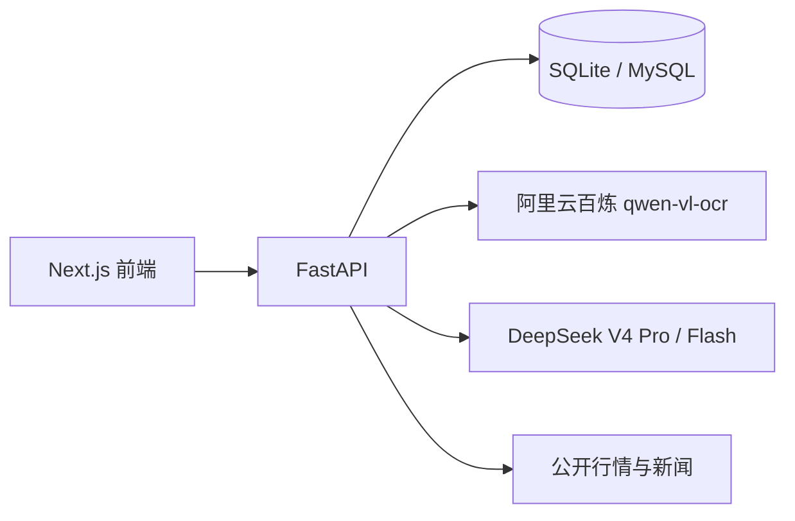

<div align="center">


# FundPilot AI

**截个图，就懂你的基金。**

私人基金投研助手：上传支付宝 / 养基宝截图更新持仓，按个人风控生成 DeepSeek 深度日报，并从全量基金目录中筛出有证据、过质量门的近期机会。

[在线体验](https://www.hllingxi.cn) · [项目上下文](docs/PROJECT_CONTEXT.md) · [部署指南](docs/deploy/lighthouse-cicd.md) · [安全说明](docs/SECURITY.md)

[](https://github.com/HLLLG/fundpilot-ai/actions/workflows/ci.yml)
[](https://github.com/HLLLG/fundpilot-ai/actions/workflows/frontend-perf.yml)


</div>

---

面向个人或不超过 5 人的私有部署。不自动下单，不对接券商，报告只作投研辅助，不构成投资建议。

## 目录

- [功能](#功能)
- [技术栈](#技术栈)
- [快速开始](#快速开始)
- [推荐使用流程](#推荐使用流程)
- [推荐基金](#推荐基金)
- [环境变量](#环境变量)
- [仓库结构](#仓库结构)
- [开发与验证](#开发与验证)
- [部署](#部署)
- [文档](#文档)
- [隐私与边界](#隐私与边界)

## 功能

| 模块 | 做什么 |
|------|--------|
| **持仓台账** | 上传支付宝「我的基金」或养基宝总览截图，预览确认后写入账户汇总；也可粘贴 OCR 文本或手动录入 |
| **导入交易** | 支付宝「交易分析」截图写入买卖流水。进行中交易先以上看板（不计收益、不加总资产），确认日净值公布后再入账 |
| **行情** | A 股五指数、美股期货、主题板块涨幅榜（连涨天数、主力净流入、列头排序）；休市锁定后后台不再打源 |
| **盈亏分析** | 收益走势（相对沪深 300）、盈亏日历、当日 TOP5、持仓分布；组合风险与压力测试按需展开 |
| **投研日报** | 按个人风控画像生成逐基金操作建议、主题要闻摘要与新闻原文列表；后台异步执行，完成后可桌面通知 |
| **推荐基金** | 从免费全量目录做有界候选，经质量门后给出「今日可布局 / 等待合适位置 / 方向观察」 |
| **报告追问** | 日报与荐基报告内按需对话（快速 / 深度）；深度模式可补拉持仓、目录、方向账本或新闻 |
| **账号** | 邮箱注册 / 登录（JWT，默认 30 天）；持仓、日报、荐基按用户隔离 |

持仓看板按养基宝式展示代码、金额、持有 / 当日收益和板块涨跌。盘中当日收益按关联板块估算（标 ≈）；真实份额、成本、现金与费用未录入时保持 unknown，不按 0 猜测。

日报与荐基的新生成固定走**深度分析**。仓位建议是相对当前估算持仓的动态百分比，并同步展示「约 ¥金额」，不冒充可执行固定金额。

## 技术栈



| 层 | 选型 |
|----|------|
| 前端 | Next.js 16、React 19、TypeScript、Tailwind CSS 4 |
| 后端 | FastAPI、Pydantic v2、Uvicorn；生产将请求进程与专职 Worker 分离 |
| 存储 | 本地 SQLite（`data/app.db`）；生产 MySQL |
| 识别 | 阿里云百炼 `qwen-vl-ocr`（未配置 Key 时改用手动输入） |
| 模型 | DeepSeek V4 Pro（主报告）/ Flash（摘要与快速追问） |
| 行情 | 东方财富、AkShare 等公开源 |

## 快速开始

需要 **Python 3.12**、**Node.js 22**。Windows 可用 Git Bash 或 PowerShell。

```bash
git clone https://github.com/HLLLG/fundpilot-ai.git
cd fundpilot-ai
cp .env.example .env
```

编辑 `.env`，至少填入：

```env
FUND_AI_DEEPSEEK_API_KEY=sk-...
FUND_AI_JWT_SECRET=change-me-to-a-random-secret-at-least-32-chars
NEXT_PUBLIC_API_BASE_URL=http://127.0.0.1:8000
```

截图识别另需 `FUND_AI_VLM_OCR_API_KEY`（阿里云百炼）。不配也能手动录入持仓，其它分析不受影响。

**本地请把 `FUND_AI_DATABASE_URL` 留空**，使用 `data/app.db`。若填了本机连不上的生产 MySQL，连接层可能回落 SQLite，但份额 / 交易等真值写入会被拒绝，界面会报「主数据库暂不可用」。

一条命令同时启动前后端：

```bash
# Git Bash / macOS / Linux
bash scripts/dev.sh
```

```powershell
# Windows PowerShell
.\scripts\dev.ps1
```

浏览器打开 [http://127.0.0.1:3001](http://127.0.0.1:3001)。默认监听 `8000`（API）与 `3001`（Web）；端口已被占用时启动脚本会拒绝再起一份。

<details>
<summary>分别启动前后端</summary>

```bash
# 后端
cd apps/api
python -m venv .venv
source .venv/bin/activate          # Windows: .venv\Scripts\activate
pip install -r requirements-dev.txt
python -m uvicorn app.main:app --host 127.0.0.1 --port 8000

# 前端（另一个终端）
cd apps/web
npm install
npm run dev
```

前端 dev 使用 webpack，避开 Windows 下偶发的 Turbopack panic。仅在主动改 API 时设置 `FUND_AI_DEV_RELOAD=true` 打开热重载。

</details>

## 推荐使用流程

1. 打开 `/register` 注册，或 `/login` 登录。
2. 在 **持仓** 页用「新增持有」上传支付宝 / 养基宝总览截图；买卖流水走「导入交易」。
3. 预览确认后写入账户汇总。进行中交易先出现在看板，确认日净值公布后再计入持仓。
4. **行情** 看主题板块与指数；**我的 → 盈亏分析** 看收益走势、日历与分布。
5. **推荐基金** 选择市场优选或组合补缺，可选关注方向与预算，扫描今日机会。
6. **生成日报** 确认风控画像与 AI 角色后生成深度日报；右下角浮层查看进度。
7. 在报告页追问、对比上一份日报，或导出 Markdown。换机迁移可走数据库导出 / 导入 API，导入前先备份原库。

## 推荐基金

「推荐基金」与「生成日报」共用同一套风控画像，但使用独立的 AI 角色与报告存储，不会把荐新基混进日报 Prompt。

| | 生成日报 | 推荐基金 |
|---|----------|----------|
| 分析对象 | 已有持仓 | 全量目录筛出的有界候选 |
| AI 角色 | `analysis-prompt` | `discovery-prompt` |
| 输出 | 逐基金调仓建议 | 荐基报告（可执行 / 等待 / 观察） |
| 历史 | 阅读区导航 + 历史抽屉 | 独立侧轨 / 抽屉工作区 |

| 扫描模式 | 说明 |
|----------|------|
| 市场优选（默认） | 轮转召回资金拐点、短热度、弹性、蓄势和回调承接方向，再按完整证据与成熟度横向比较 |
| 组合补缺 | 优先组合低配置且证据成熟的方向；持仓暴露与预算进入确定性门禁 |

关注方向最多 3 个，优先进入证据召回，但不能绕过资金、价格、质量、费用、预算和集中度门禁。主扫描固定深度分析、后台异步执行；报告内追问仍可选快速 / 深度。

## 环境变量

根目录复制 `.env.example` 为 `.env`。`.env` 已被 gitignore，不要提交。完整列表见模板与 [项目上下文](docs/PROJECT_CONTEXT.md#环境变量)。

| 变量 | 说明 |
|------|------|
| `FUND_AI_DEEPSEEK_API_KEY` | DeepSeek API Key（必填才能生成报告） |
| `FUND_AI_DEEPSEEK_MODEL` | 主模型，默认 `deepseek-v4-pro` |
| `FUND_AI_DEEPSEEK_MODEL_FAST` | 摘要 / 快速追问，默认 `deepseek-v4-flash` |
| `FUND_AI_JWT_SECRET` | JWT 签名密钥，至少 32 字符 |
| `FUND_AI_VLM_OCR_API_KEY` | 阿里云百炼 Key；不配则截图识别不可用 |
| `FUND_AI_DATABASE_URL` | 设则使用 MySQL；**本地开发请留空** |
| `NEXT_PUBLIC_API_BASE_URL` | 前端请求的 API 地址 |

<details>
<summary>新闻、运行角色与其它可选开关</summary>

| 变量 | 说明 |
|------|------|
| `FUND_AI_NEWS_ENABLED` | 是否注册新闻 Tool，默认 `true` |
| `FUND_AI_NEWS_SOURCES` | `eastmoney`、`announcement`、`macro` |
| `FUND_AI_NEWS_SUMMARIZE` | 是否用 Flash 按主题生成 `topic_briefs` |
| `FUND_AI_RUNTIME_ROLE` | `all`（本地默认）/ `api` / `worker`；生产已拆开请求与后台任务 |
| `FUND_AI_LANGGRAPH_ENABLED` | 默认 `true`。追问 / 日报 / 荐基走编排轨迹；`false` 回线性实现，不改仓位与质量门 |
| `WEB_CONCURRENCY` | Uvicorn worker 数；生产 4 核默认 2，本地仍为 1 |

DeepSeek 只在 TCP/TLS 尚未建立时自动重试连接错误，不会重放已经开始响应的模型请求。

</details>

## 仓库结构

```text
fundpilot-ai/
├── apps/api          FastAPI：领域路由、服务、后台 Worker
├── apps/web          Next.js：持仓 / 行情 / 荐基 / 日报
├── data              本地 SQLite（云端可迁 MySQL）
├── uploads           本地上传截图
├── scripts           开发启动、库迁移、行情诊断
├── docs              项目上下文、部署与安全手册
└── .github/workflows CI、前端性能、部署，以及方向状态 / Factor IC 等定时任务
```

架构、API 与现行业务契约以 **[docs/PROJECT_CONTEXT.md](docs/PROJECT_CONTEXT.md)** 为准。新对话或接手开发时先读该文件。

## 开发与验证

后端单测默认离线 stub，不访问东财 / AkShare / MySQL：

```bash
cd apps/api
source .venv/bin/activate          # Windows: .venv\Scripts\activate
python -m pytest tests -q
```

与 CI 一致的并行跑法（需 `pytest-xdist`；Windows 上偶发不稳定）：

```bash
python -m pytest tests -q -n auto --dist loadscope
```

本地若 `.env` 配了 MySQL，跑测前先清空，强制走 SQLite（与 CI 相同）：

```bash
export FUND_AI_DATABASE_URL=
export FUND_AI_FUND_NAME_PRELOAD_ENABLED=false
export FUND_AI_NEWS_ENABLED=false
export FUND_AI_SECTOR_SIGNAL_BACKTEST_ENABLED=false
```

前端：

```bash
cd apps/web
npm run lint
npm run typecheck
npm test
npm run build
```

GitHub Actions 的 `CI` 并行跑 API pytest、Web lint / typecheck / 单测，以及 Playwright 三视口冒烟。

<details>
<summary>给贡献者的两点注意</summary>

- 新增由定时任务通过 `docker compose exec api python scripts/<name>` 调用的脚本时，必须同时更新根目录 `Dockerfile`、`apps/api/Dockerfile` 以及两份 `.dockerignore` 白名单。镜像刻意不整目录拷 `scripts/`。漏掉任何一处，任务只会在 Actions 日志里失败，界面上看不出来。`apps/api/tests/test_capture_script_is_packaged.py` 会把这四处锁住。
- 方向退出判定依赖逐日账本。生产需跑 `.github/workflows/sector-direction-capture.yml`（每交易日 19:10，Asia/Shanghai）。不跑则连续跌破天数会停在 1。补历史见 `apps/api/scripts/README.md`。

</details>

## 部署

面向小团队私有部署：腾讯云 Lighthouse 上 Nginx 提供同源静态站点并反代 FastAPI / SSE；API、专职 Worker 与 MySQL 由容器运行。`main` 的 CI 通过后部署同一个已验证 commit。

完整步骤见 **[docs/deploy/lighthouse-cicd.md](docs/deploy/lighthouse-cicd.md)**。

```bash
export FUND_AI_JWT_SECRET=your-secret-32chars-minimum
docker compose -f docker-compose.local.yml up --build
```

## 文档

| 文档 | 内容 |
|------|------|
| [docs/PROJECT_CONTEXT.md](docs/PROJECT_CONTEXT.md) | 产品、架构、API、数据流与现行业务 / 量化契约 |
| [docs/deploy/lighthouse-cicd.md](docs/deploy/lighthouse-cicd.md) | Lighthouse + GitHub Actions 发布 |
| [docs/SECURITY.md](docs/SECURITY.md) | API Key、权限、密码重置与 Secret Scanning |
| [docs/perf/web_frontend_20260725.md](docs/perf/web_frontend_20260725.md) | 前端首屏体积与交互性能口径 |
| [.env.example](.env.example) | 环境变量模板 |

## 隐私与边界

本项目面向个人自用。截图、数据库和上传文件默认保存在本地项目目录。DeepSeek 会收到你确认后的结构化持仓、风控参数、净值摘要、主题新闻摘要、新闻标题 / 短摘要，以及已生成日报全文（追问时）。报告与对话只用于个人投研辅助，**不构成投资建议，也不会执行任何交易**。

截图识别只有一条路：配置 `FUND_AI_VLM_OCR_API_KEY` 后，截图先到本应用服务端，再转发到云端 `qwen-vl-ocr` 做纯图转文字；识别文本按图片 sha256 缓存，同一张图不会重复外发。未配置 Key 时请改用手动输入。**不希望截图外传就不要走识别。** 发给 DeepSeek 的始终是确认后的结构化持仓，不是原始截图。
