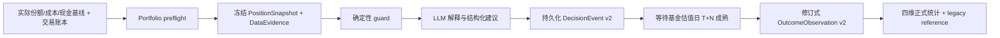

# 灵析决策准确性 V2（日报 / 荐基）

## 目标

本轮把“模型说得像对”改造成“数据在决策时点可用、动作可复现、结果成熟后才评价”的闭环。核心原则：

1. LLM 只解释系统事实，不负责制造份额、现金、基准或命中率。
2. 同一字段记录来源、时点、新鲜度、置信度及是否估算；`null/unknown` 不得按 0 猜测。
3. 未成熟样本、观察动作、旧动态报告和数据缺口不进入正式 V2 分母。
4. 正式结果固化为不可变证据；自动调参继续关闭，直到样本量与时间外验证达标。

## 决策链

## 1. 南向资金契约

- 决策 facts 只保留 `stock_connect_flow.v2` 南向契约。
- 已永久退役不可持续披露的外资流向证据：数值、不可用状态、原因、兼容入口和 Prompt 缺失提示均不再进入新决策。
- 联合源数据在子进程边界只保留南向行；南向净流入仅作为港股资金面的独立参考，并必须满足交易日对齐和缓存过期边界。
- 最终输出守卫会删除模型自行生成的已退役证据字段与句子，避免把“数据不可用”再次包装成风险因子。
- 流式界面只接收清洗后的结构化 partial；历史报告在展示、导出和追问边界清洗副本，但不修改数据库中的不可变审计原文。

## 2. 实际仓位账本与 PortfolioSnapshot

### 真值来源

- 用户可一次性确认每只基金的实际份额、可选总成本和可选现金余额。
- 交易优先使用用户在原平台确认的实际份额；没有实际份额时才降级为 `amount / NAV` 派生值。
- 手续费未知时保持 `None`，不按 0 处理；未知费用会使费后成本和已实现收益不可用于正式判断。
- 旧用户的金额/净值推算只标记为 `estimated_legacy`，继续可见但不能冒充用户确认真值。
- 删除持仓会追加绝对零份额事件，避免旧买入事件在下一次决策中复活“幽灵仓位”。

### 不可变账本

- `portfolio_ledger_events` 使用追加写、逻辑事件修订、CAS head 与哈希链。
- pending、未来确认日、冲突、事件截断或持仓成员不一致都会使 `position_complete=false`。
- 确认事件可 supersede pending 版本；未来确认日在生效日前只作为已知未结算承诺，不进入 settled shares。
- 权威空仓且不存在 ghost/conflict/unsettled 时是完整空组合；现金未知只限制预算金额，不否定空仓成员真值。
- 若生产配置 MySQL 但只能连接本地 SQLite fallback，份额、交易和删除真值写入 fail-closed（HTTP 503），避免主库恢复后“确认成功的数据”消失。

### 决策输入

- 服务端持仓始终覆盖客户端旧请求；合法空仓快照不能被客户端旧持仓复活。
- Prompt 只接收 compact position truth：基金、settled shares、成本、现金、完整性、冲突与 pending 计数，不传整条账本历史。
- `position_complete=false` 或存在 pending/conflict 时，日报和荐基 guard 清除买入金额/仓位变化；已知现金会封顶荐基预算，现金为 0 时禁止给出执行金额。
- 每次报告冻结 snapshot id、ledger version、position fingerprint、valuation version 和证据可用时间。

## 3. DataEvidence v1

| 字段 | 含义 |
| --- | --- |
| `fact_id` | 稳定事实路径 |
| `source` / `source_type` | first-party / official / third-party / derived / user-input |
| `as_of_date` | 数值实际对应日期 |
| `available_at` | 该事实最早可被决策使用的时间 |
| `fetched_at` | 本次取数时间 |
| `freshness` | fresh / aging / stale / unknown / unavailable |
| `confidence` | high / medium / low / none |
| `is_estimate` | 是否为估算或派生值 |

缺少源日期时标为 `unknown`，不会因数值非空伪装成 `fresh`。Prompt 要求 `stale/unavailable/none` 不得支撑动作，`is_estimate=true` 必须降低置信度；最终 guard 再执行同一边界。

## 4. 点时基准合同

- 决策只读取 `available_at <= decision_at` 的已缓存基准文本，生成时不临时联网补齐，避免未来信息泄漏。
- 只有来源为已验证/实时的完整基金业绩比较基准合同，且所有组成项、权重和代码齐全，才冻结为 `fund_contract_exact` 并进入正式超额。
- 跟踪标的只冻结为 `tracked_index_exact` 参考层；类别代理为 `category_proxy`，两者均不得进入正式超额统计。
- 静态 fallback、截断文本、未知组成项、权重不闭合或任一组成项无法取值时，完整合同整体不可用；不得丢掉缺失腿后重新归一化权重。
- 基准 mapping 与 DecisionEvent 在同一数据库事务内固化。

## 5. 基金估值日 T+N

### 日报

- 默认 T+1、T+5、T+20。
- 执行日由报告时点与交易规则确定；基线取执行日起首个可用基金净值，目标取该基金随后第 N 个估值日。
- QDII 与非 A 股基金不强套 A 股交易日历；目标净值未成熟或缺失时保持 pending/data unavailable。
- 加仓/买入为看多，减仓/卖出为看空，观察/复核单列；同日多份日报只保留最后一版进入汇总。

### 荐基

- 正式窗口 T+5、T+20、T+60；旧 T+7 接口仅作兼容。
- 使用每只基金自身去重后的 NAV 估值日。
- `建议关注 / 观察 / 等待回调 / 未知动作` 不进入买入命中分母。
- 明确买入只有 T+N 毛收益大于 0 才算方向一致；未成熟时收益和命中均为 `None`。

## 6. 四套互不混合的指标

| 指标 | 含义 | 正式前提 |
| --- | --- | --- |
| `gross_direction` | 毛收益方向是否与建议一致 | 成熟基金净值 |
| `positive_net_return` | 扣除用户费用假设后是否仍为正收益 | 成熟净值 + 已冻结费用假设 |
| `gross_excess` | 毛收益是否跑赢完整基金合同基准 | 完整 `fund_contract_exact` |
| `net_excess` | 假设费后收益是否跑赢完整基金合同基准 | 完整合同 + 费用假设 |

- 每项独立返回 `eligible / mature / value_percent / hit / unavailable_reason`，并独立计算覆盖率与命中率。
- 当前 1.5% 是用户风险画像中的往返费用假设，不是平台实际扣费。基金管理费、托管费等已体现在公布净值中，不重复扣除。
- legacy 报告继续在 `legacy_reference` 展示，但明确 `excluded_from_formal_v2=true`。

## 7. DecisionEvent / OutcomeObservation 持久化

- 报告、PortfolioSnapshot、benchmark mapping、DecisionEvent v2 和初始 observation 在同一事务中保存。
- Event 固化：动作、评价类别、固定 horizons、仓位版本、基准合同、费用假设、模型/Prompt/策略版本和审计资格。
- Observation 使用 revision 表记录每次取数；pending/data unavailable 可重试，成熟终态被锁定。
- 对相同终态的重试幂等；若后续来源给出与已冻结终态不同的净值，返回证据冲突（HTTP 409），不静默覆盖。
- 正式统计只纳入 `persistence=persisted`、主存储、`audit_eligible=true`、DecisionEvent v2 且事件可评价的样本。
- 每日 `Decision Outcome Settlement` 自动处理日报 T+1/5/20 与荐基 T+5/20/60 的 pending 观察；数据源暂缺时保持可重试，成熟终态不可改写。生产配置 MySQL 时拒绝回落 SQLite，避免结算写入错误数据库。
- `quant_evidence.v2` 冻结模型快照 ID/生成与发布时间，以及目标基金特征截止日、观察时间、来源、净值交易日年龄和收益覆盖；二者不再共用一个含混的 `data_as_of`。模型尚未发布、时间来自未来、普通基金净值超过 1 个交易日、QDII 超过 2 个交易日或覆盖不足时退出正式量化校准。
- 线上校准仅做影子报告：按决策日、模型、同类、可靠性、因子家族/键/方向/百分位与 horizon 分组，明确属于条件相关而非因果；永不自动调权或改 Prompt/Guard。

## 8. 历史回填与迁移

- `scripts/backfill_decision_events_v2.py` 默认 dry-run，只有 `--apply` 才写入。
- 旧报告可生成 legacy Event/Snapshot 供追溯，但 `metric_eligible=false`，不污染正式 V2。
- 回填按 `source_type + source_report_id` 去重，并在 dry-run 阶段预检不可变内容哈希冲突。
- SQLite→MySQL 迁移默认 dry-run；新证据表 insert-only，同内容跳过、异内容硬失败并整笔回滚，不使用 `REPLACE` 覆盖不可变证据或账本链。

## 9. 当前落地状态（2026-07-13）

- 当前 SQLite 已升级到 schema v11；新增成员 PIT 基金池快照/成员表，MySQL bootstrap 与 SQLite→MySQL 迁移脚本已同步。
- 已对本地现有历史数据执行一次正式回填：扫描日报 8 份，新增 legacy DecisionEvent 26 条、PortfolioSnapshot 6 份；当前库没有可回填的历史荐基报告。
- 同一回填命令二次执行新增 0 条，证明 `source_type + source_report_id` 幂等边界生效；完整性检查、外键检查、事件/快照证据哈希均通过，原日报和荐基表保持字节一致。
- 历史数据无法可靠还原决策后各估值日当时可得的净值、费用与完整基准，因此 `outcome_observations=0` 是预期结果；所有回填事件均 `metric_eligible=false`，不会污染正式 V2。
- 正式四指标样本从改造后新生成的日报和荐基开始积累；成熟前保持 pending，数据缺失保持 unavailable，不使用当前数据反推历史结论。
- 本轮新增结果自动结算、量化证据冻结和线上影子校准；最终本地验收：API **1180 passed**，Web **382 passed**，typecheck、lint、Next production build 全通过；CI 同口径 smoke 为 API **3 passed**、三视口 UI **30 passed / 6 expected skips / 0 failed**。

## 验收边界

- 新决策 facts、Prompt 和报告输出均不存在已退役外资流向的数值、状态或缺失提示。
- `null/unknown` 不按 0 猜测；pending/conflict/incomplete position 不产生可执行金额。
- 实际份额不被 legacy 金额/NAV 或重复交易二次累计；删除持仓不留下正份额 ghost。
- 日报按 T+1/T+5/T+20、荐基按 T+5/T+20/T+60 的基金估值日成熟样本评价。
- 只有完整冻结的基金合同基准进入正式超额；代理与跟踪指数只作参考。
- 四套指标分母独立，覆盖率和命中率均在 0%～100%。
- 正式报告能追溯 PositionSnapshot、DataEvidence、BenchmarkMapping、DecisionEvent v2 与 OutcomeObservation v2。
