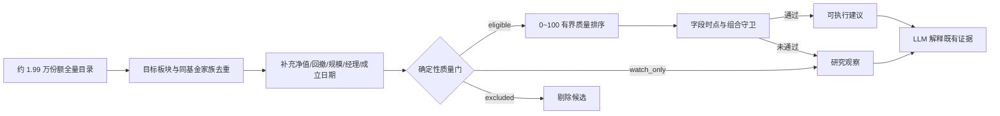

# 荐基质量 V2：有效性审计与实现说明

> 审计日期：2026-07-13；范围：荐基前端、同步/流式/离线管线、候选池、确定性评分、字段证据守卫、历史荐基结果。本文描述的是研究与决策支持能力，不承诺收益。

## 技术结论

原来的 27 种组合并没有形成 27 种有效决策方法。真正有独立业务价值的只有「市场优选」和「组合补缺」两个目标；选基策略与基金类型偏好应由系统根据数据质量、风险和产品结构自动处理。短线抄底、跌深反弹与“高信任主荐基”冲突，已于 2026-07-13 连同大跌雷达完整退役；新发基金只保留质量门内的普通研究观察语义，不再是独立选基策略。

本次实现把荐基从“模型从一个偏置窄池里凑出 3～5 只”改成“全量横截面预筛 → 数据准入 → 有界评分 → 证据守卫 → LLM 解释”。系统现在允许返回 0 只可执行基金；低置信、字段不足、等待回调的项目不会再进入「优先行动」。

## 历史证据显示选项冗余且结果不可比较

审计使用配置数据库中 44 份历史荐基报告（2026-06-15 至 2026-07-13）和 497 条历史候选。当前样本没有足够的正式 DecisionEvent V2 买入结果，不能据此声称某个模式能提高未来收益。

| 观察项 | 结果 | 技术解释 |
|---|---:|---|
| 扫描模式 | 全市场 39 / 组合补缺 2 / 短线 3 | 组合补缺样本不足；3 次短线扫描候选池均为空 |
| 选基策略 | 均衡 36 / 跌深反弹 4 / 含新发 4 | 普通主路径此前始终按均衡分排序；含新发没有稳定保留槽 |
| 最终动作 | 等待 67 / 关注 65 / 买入 6 | 95.7% 不是买入动作，无法用作策略收益比较 |
| 非买入仍带金额 | 132 / 132 | Prompt 强制金额、guard 未清空，属于误导性缺陷 |
| 最大回撤缺失 | 404 / 497（81.3%） | 质量分在补数前计算，补数后未重算 |
| 规模 / 类型 / 管理费缺失 | 497 / 497（100%） | 旧候选档案链路没有提供这些字段 |
| 旧质量分范围 | -4.89～134.22 | 原公式无边界，极端短期收益可把分数推过100 |

历史结果是描述性证据，不是因果或预测证据。模式分布严重不均，且大多数条目没有执行，因此不能把事后净值变化解释成某个按钮的有效性。

## 九个选项的处理结果

| 原选项 | 实际行为 | V2 处理 |
|---|---|---|
| 全市场机会 | 原来主要依赖近1年涨幅前300 | 保留并改名「市场优选」，候选横截面升级为全量目录 |
| 持仓缺口补充 | 有独立组合价值，但目标板块曾被通用机会板块覆盖 | 保留并修复模式语义 |
| 短线抄底 | 高风险、3次历史运行均为空池 | 完整退役；删除外部预填、请求参数和专用处理链 |
| 均衡潜力 | 唯一稳定参与普通排序的策略 | 内化为自动质量优选，不再让用户选择 |
| 含新发观察 | 历史不足，且实现未稳定保留新发槽 | 仅研究观察，不进入高信任推荐 |
| 跌深反弹 | 普通主路径基本不生效 | 完整退役；不再保留专用排序策略 |
| 不限 | 覆盖最完整 | 作为内部默认 |
| ETF联接优先 | 实际是名称硬过滤，不是“优先” | 取消硬过滤；主动/被动分轨仍是后续增强项 |
| 排除C类 | 未考虑金额、持有期和真实费率 | 取消；同基金家族去重，费用未核验时明确提示 |

## 新决策链先准入、后解释

LLM 不再负责从全市场自由编造基金，也不能把观察项升级为买入。它只能解释候选池中的确定性事实；`quality_gate=excluded` 禁止进入推荐，`watch_only` 由确定性 Guard 固定降为「建议关注」。

## 数据与评分口径

### 候选横截面

- 默认分页读取股票、混合、债券、指数、QDII、FOF 等开放式基金目录，24 小时共享缓存。
- 冷启动失败或超时才回退近一年排行前 500，并在候选中记录 `candidate_universe_mode` 和实际规模。
- 同一底层基金的 A/C 等份额继续按家族去重，避免重复占据 Top N。
- 组合补缺保留持仓低配置方向，不再被通用机会榜覆盖。

### 基金研究档案

候选在评分后补数的问题已反转为“先补数、再重算”。新增字段包括：最新净值及日期、近1年最大回撤、当前规模估算、基金类别、成立日期、基金经理和档案更新时间。

- 主源为 Sina `fund_scale_open_sina`：按最新单位净值 × 最近总份额形成规模估算，并记录 `fund_scale_basis=nav_times_latest_shares` 与源更新时间。
- 回退源为雪球/蛋卷 `fund_individual_basic_info_xq`：AKShare 展示名“最新规模”的原始字段其实是 `totshare`（基金份额），因此只保存为 `fund_shares_yi` / `xq_latest_reported_shares`，并补齐经理与成立日；仅当 Sina 与基金快照都没有规模、且候选已有有效最新单位净值时，才换算为 `fund_scale_basis=nav_times_xq_latest_shares` 的 AUM 估算。
- 两个独立源在冷缓存时并行获取；单源故障不会再让整批候选的规模和经理同时为空。若两源都失败，旧值只以 `stale_fallback` 参与研究观察，不能产生买入。
- 档案缓存改为逐基金 `profile_checked_at/profile_status/profile_missing_fields/profile_stale_fields` 管理。完整行 36 小时刷新，不完整或失败行 30 分钟重试；新增代码不再通过重置整包 TTL 让旧行永久不过期，半空行也不再仅因代码已存在而永久阻止补数。
- 同源新鲜观测可以更新旧值：本轮有效 Sina 字段始终替换旧 Sina 值，本轮有效 XQ 份额始终替换旧 XQ 份额；若份额源刷新失败，旧份额会被标为规模证据过期，不会借新的检查时点变成可执行 AUM。

XQ 份额本身绝不直接参与 0.5/1 亿元准入阈值；系统只按“Sina 规模估算 → 基金快照 AUM → XQ 份额×有效最新净值”的优先级补空，并保留口径与来源，不做静默平均。

### 补全后再定最终候选

常规扫描先为每个方向多取一个后备候选、总池最多额外预取 4～8 只，完成净值和研究档案补全后再执行质量门。`excluded` 不再占据最终板块名额；系统先按每个目标板块的补数后质量选足配额，再用全局高质量候选补齐总池。这样低规模、成立不足一年或档案失效的基金不会把更可靠的后备基金挡在候选池外。

### 质量门

核心字段是近3月收益、近6月收益、近1年最大回撤、最新规模、成立日期、基金经理和净值日期。

- `excluded`：最新估算规模 < 0.5 亿元，或成立不足 1 年。
- `watch_only`：规模处于 0.5～1 亿元、核心字段不全、净值超过 7 个自然日或近 1 年最大回撤超过 50%；可以研究，但不生成可执行买入动作。
- `watch_only`：档案缓存过期且双源刷新失败；即使旧缓存字段齐全也只能研究观察。
- `eligible`：核心字段完整且没有命中上述硬条件。

`watch_only` 现在由后端确定性 guard 强制降为「建议关注」、清空金额并把置信度限制在中或低；它不再只依赖 Prompt 自律。正向量价共振也不能绕过该状态提高建议金额。

可执行契约采用 fail-closed：只有显式 `quality_gate.status=eligible` 才可能保留买入；缺失/未知门禁一律观察，同基金重复输出只保留首条，否定买入文案先于买入关键词解析，非有限/非正金额与零/非有限预算都会清金额并降级。只要报告携带量化候选事实，还必须满足 IC 当前可用且基金代码位于 `applicable_fund_codes`，否则同样只能观察。

0.5 亿元使用公募基金连续低规模需要披露和处置安排的监管阈值作为保守准入线；它不是收益预测指标。

### 有界质量分

`fund_quality.v2` 被限制在 0～100，并保存分项：板块匹配、阶段表现、回撤控制、规模、数据完整性、历史兼容类型偏好。阶段收益使用有界映射；近1年超过100%会增加追高惩罚，无法再通过极端涨幅把总分推到100以上。质量分只负责候选排序，不能绕过质量门和证据守卫。

## 已修复的高影响缺陷

1. 组合补缺和短线目标板块被通用 `sector_opportunities` 覆盖。
2. 普通候选的跌深反弹策略未参与主排序。
3. ETF联接“优先”实际执行严格过滤。
4. 补数后不重算质量分，异常回撤可与高分共存。
5. 回撤小于 -100% 的不可能值未先清洗。
6. 字段证据只看 NAV 日期，不检查候选质量门。
7. 非买入动作仍保留建议金额。
8. Prompt 强迫输出 3～5 只，无法诚实表达“无合格基金”。
9. 所有 recommendations（包括低置信关注）都展示为「优先行动」。
10. 流式路径缺量价背离历史上下文，新闻主题可能与最终方向错位。
11. 短线模式错误使用年度赢家榜；“连续10日下跌”只拿5日数据而永远无法触发。
12. 全局板块预计算 miss 不推进游标，批任务反复卡在同一批代码。
13. 基金档案缓存只按代码命中，半空行与过期完整行可能永不刷新。
14. 档案只有单一规模全表源，源站超时会令整批规模/经理同时缺失。
15. `watch_only` 只写入 Prompt，确定性 guard 未显式阻断高分候选买入。
16. 桌面历史推荐常驻侧栏压缩候选表有效宽度，长短板文字进一步放大遮挡。
17. XQ `totshare` 曾被误当成亿元 AUM，可能直接污染 0.5/1 亿元准入线。
18. partial 缓存拒绝用本轮新鲜 Sina 字段覆盖旧非空值，导致档案值冻结。
19. 未知质量门禁、重复基金、否定买入文案、非有限/非正金额和零预算曾存在 Guard fail-open。
20. 过期档案字段曾继续计入 100% 覆盖率和规模分，并可能触发硬剔除。
21. 移动历史抽屉只设 `max-height` 未设确定高度，长列表可越过视口底部。
22. partial 行补齐其他字段时曾拒绝覆盖同源新份额，或把刷新失败的旧份额随新检查时点误标为完整新鲜档案。

候选池界面现直接汇总「字段完整 / 待补或刷新 / 质量降级 / 状态未记录」数量，桌面将长篇理由与短板收进每行的「证据状态」详情，移动端采用同一口径；历史推荐改为所有视口按需打开的焦点受控抽屉，主研究区恢复整宽。

## 与官方方法和竞品的对照

- Morningstar 历史评级要求在同类基金内比较风险调整收益，而不是跨类别按绝对涨幅排序；前瞻 Medalist 又把主动基金的 People/Process/Parent/Price 与被动基金的指数过程、跟踪和费用分开评价。[历史评级方法](https://www.morningstar.com/content/dam/marketing/shared/research/methodology/771945_Morningstar_Rating_for_Funds_Methodology.pdf)；[2026 Medalist 方法](https://s205.q4cdn.com/437373358/files/doc_downloads/2026/Morningstar_Medalist_Rating_Methodology-April-2026.pdf)
- 证监会要求业绩比较基准与基金实际风格匹配并保持稳定，这支持后续按同类/基准分组而非混排。[公开募集证券投资基金业绩比较基准指引](https://www.csrc.gov.cn/csrc/c100028/c7610827/content.shtml)
- A/C 份额的经济性取决于申购费、销售服务费、赎回费、金额和持有期，不应机械排除某一类。[易方达基金 A/C 份额说明](https://edu.efunds.com.cn/c/17/17882.shtml)；[证监会基金销售费用新规](https://www.csrc.gov.cn/csrc/c100028/c7606047/content.shtml)
- 规模、流动性、期限和复杂性属于适当性与可执行性条件；低规模不能只作为黄色提示。[公募基金运作管理办法](https://www.csrc.gov.cn/csrc/c106256/c1653978/content.shtml)；[投资者适当性管理办法](https://www.csrc.gov.cn/csrc/c101939/c1045348/1045348/files/%E9%99%84%E4%BB%B61%EF%BC%9A%E8%AF%81%E5%88%B8%E6%9C%9F%E8%B4%A7%E6%8A%95%E8%B5%84%E8%80%85%E9%80%82%E5%BD%93%E6%80%A7%E7%AE%A1%E7%90%86%E5%8A%9E%E6%B3%95.pdf)
- 天天基金筛选器提供类型、评级、规模、周期和申购状态等通用筛选，但通用筛选不等于高信任前瞻评级。[天天基金基金筛选](https://fund.eastmoney.com/data/fundguide.aspx)

## 局限性与下一阶段

本批解决了候选偏置、数据缺口、错误打分、fail-open 和展示误导，但以下字段仍不足以支撑完整的前瞻评级：

1. **主动基金过程与人员**：经理任期内超额、团队稳定性、风格漂移和持仓换手尚未接入。
2. **被动基金跟踪质量**：跟踪误差、R²、指数代表性、ETF 折溢价/价差和成交流动性尚未接入。
3. **真实份额费用**：当前能做家族去重，但无法基于平台申购折扣、赎回费和销售服务费证明某份额最低成本，所以明确标记“费用待核验”。
4. **正式收益验证**：历史报告缺少足够成熟的 DecisionEvent V2 买入样本。需积累 5/20/60 交易日、假设费后与相对合同基准结果，再校准评分权重。
5. **同类分轨**：Factor IC V2 已提供同类研究方向，但只有运行时快照为 V2、同类映射有效且可靠性通过时才可作为证据；当前确定性质量分不会被不可靠 IC 抬高。
6. **多进程档案缓存**：当前腾讯云 Lighthouse 生产编排固定 1 个 API worker，进程内 single-flight 可避免并发覆盖；若未来切换到多 worker，需要把整包档案缓存改成逐代码键或数据库 CAS/行锁，避免跨进程 read-modify-write 丢失并集。

建议下一批按顺序实现“真实费率与申购状态 → 主动/被动分轨 → 经理任期/跟踪误差 → 样本外权重校准”。

## 验证口径

验收应至少覆盖：全量目录成功与前500降级、双源补全与字段来源、XQ 份额不冒充 AUM、逐基金缓存过期/半空重试、partial 新鲜字段与同源新份额可更新、刷新失败的旧份额保持过期、补数后重算与最终候选回填、异常/非有限数值清洗、零收益不误判缺失、低规模/新发剔除、字段不全或档案过期只观察且陈旧字段不计满覆盖/硬剔除、`watch_only` 与缺失/未知门禁确定性阻断买入、重复代码去重、否定动作不反转、非法金额/零预算降级、量化未覆盖降级、非买入金额清空、组合补缺不被覆盖、流式/同步配置一致、0只可执行展示、观察候选不标已推荐、历史抽屉不占正文宽度且 320px 不越界、历史报告显示真实配置，以及 UTF-8 子进程返回中文名称不损坏。

本轮用截图中的 15 只真实基金复核：Sina 主源返回 15/15，雪球/蛋卷回退源的份额/成立日/经理单独返回 14/15；v4 安全缓存双源合并后冷缓存 15/15 核心档案完整（约 21.88 秒），热缓存约 0 秒。补全并执行质量门后为 7 只 `eligible`、6 只 `watch_only`、2 只 `excluded`，最终候选池正确移除硬排除项并回填为 13 只。自动化验收：API **1211 passed**；Web **383 passed**，typecheck、lint、production build 全通过；smoke API **3 passed**，三视口 UI **30 passed / 6 expected skips / 0 failed**。
