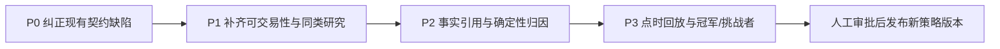
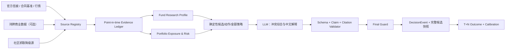

# 灵析荐基 / 日报准确性增强 V4

> 状态：Phase A1 已验收；Phase A2、Phase B、Phase C 已完成自主验证；Phase D1～D4 的点时评估、生产运营、候选标签与来源验真链，以及 Phase D5 的真实配对 Prompt shadow 与统计门禁均已实现；当前继续积累 forward-only 样本，任何策略晋级均须人工审批
> 初始审计日期：2026-07-13；实施状态更新：2026-07-15
> 适用范围：荐基、日报、共用数据证据、LLM 预设、决策复盘
> 前置底座：`DECISION_ACCURACY_V2.md`、`FUND_DISCOVERY_QUALITY_V2.md`、`QUANT_EVIDENCE_V3.md`、`FACTOR_IC_V2.md`
> 文件/测试级计划：`docs/superpowers/plans/2026-07-13-recommendation-daily-accuracy-phase-a.md`
> A1 验证：API `1291 passed`；Web `389 passed`，typecheck、lint、production build 通过；smoke API `3 passed`、三视口 UI `30 passed / 6 expected skips / 0 failed`
> A2 验证：API `1400 passed`；Web `397 passed`，typecheck、lint、production build 通过；smoke API `3 passed`、三视口 UI `30 passed / 6 expected skips / 0 failed`
> Phase B 验证：API `1589 passed`；Web `408 passed`；Python `compileall`、Web typecheck、lint、production build、`git diff --check` 全通过
> Phase C + D1 封板验证：API `1809 passed`；Web `424 passed`；Python `compileall`、Web typecheck、lint、production build、Playwright API/三视口 UI smoke 与 `git diff --check` 全通过
> Phase D2 封板验证：API `1881 passed`；D2 聚焦 `146 passed`；Web `424 passed`；Python `compileall`、Web typecheck、lint、production build、Playwright API/三视口 UI smoke 与 `git diff --check` 全通过
> Phase D3 封板验证：API `1931 passed`；D3 聚焦 `176 passed`；双生产镜像/独立调度链、租户隔离与数据库对抗契约均通过；Python `compileall`、`git diff --check` 通过，D3 未新增前端改动
> A2 数据边界：`announcement` 当前仅接入 AkShare `fund_announcement_report_em` 的基金定期报告，不代表已覆盖经理变更、临时公告、清盘提示等广义基金公告。

## 1. 结论先行

本节保留 2026-07-13 初始审计结论；当前实现状态以各 Phase 的“实施结果”和顶部封板验证为准。

当前两条链路已经具备持仓真值预检、点时证据、质量门禁、确定性守卫、决策事件和 T+N 结算，下一轮不应以“把 Prompt 写得更强”作为主线。审计发现，当前准确性的最大损失来自四类契约断点：

1. **结构正确性没有完全由代码兜底。** 日报不能确定性保证每个真实持仓恰好一条建议；荐基的主行业匹配标记会在数据补全前丢失，导致补全后匹配分退化。
2. **关键事实未进入决策，或事实虽存在但不可执行。** 日报未把完整的风格/周期、基金类型、带时点规模、经常性费用语义和正式基准送入决策；荐基没有把申购状态、限额、真实份额费用作为准入条件。
3. **新闻和 LLM 输出还不是可验证证据。** 基金定期报告在常规流程中基本触发不到，同日新闻按旧到新截断，“深度”模式的新闻工具没有进入生产生成链；文字中的数字和观点缺少字段级引用校验。
4. **结果闭环只能回答部分问题。** 现有 T+N 能评价明确动作，但尚不能评价候选排序、漏选机会、等待回调、置信度校准和不同 Prompt/模型版本的真实增益。

因此，建议的顺序是：



在没有成熟、可归因的样本前，不承诺“准确率提高多少”，也不自动调整 Prompt、因子权重或 Guard。

## 2. 当前链路复原

### 2.1 日报

```text
Dashboard.runAnalyze
  → /api/analyze/stream
  → 服务端持仓/账本真值预检
  → 基金快照、净值趋势、板块行情、市场广度、资金流、新闻
  → analysis_facts + DataEvidence
  → DeepSeek 结构化草稿
  → judge（默认 shadow）+ recommendation_guard
  → 报告、PositionSnapshot、DecisionEvent v2 原子保存
  → T+1 / T+5 / T+20 OutcomeObservation
```

主要代码：

- `apps/web/src/components/Dashboard.tsx`
- `apps/api/app/services/analyze_streaming.py`
- `apps/api/app/services/analysis_facts.py`
- `apps/api/app/services/analysis_payload.py`
- `apps/api/app/services/report_judge.py`
- `apps/api/app/services/recommendation_guard.py`
- `apps/api/app/services/decision_contract.py`

### 2.2 荐基

```text
FundDiscoveryPanel
  → SSE，失败后转后台任务
  → 持仓真值预检
  → 板块热度 / 目标方向 / 机会评分
  → 全量开放式基金目录召回
  → 小候选池资料补全、质量评分和门禁
  → 新闻、因子、组合缺口、DataEvidence
  → DeepSeek 结构化草稿 + discovery judge
  → discovery_guard 校正动作/金额/证据
  → 报告、候选证据、DecisionEvent v2 原子保存
  → T+5 / T+20 / T+60 OutcomeObservation
```

主要代码：

- `apps/web/src/components/FundDiscoveryPanel.tsx`
- `apps/api/app/services/discovery_streaming.py`
- `apps/api/app/services/discovery_pipeline.py`
- `apps/api/app/services/discovery_candidate_pool.py`
- `apps/api/app/services/discovery_facts.py`
- `apps/api/app/services/discovery_payload.py`
- `apps/api/app/services/discovery_judge.py`
- `apps/api/app/services/discovery_guard.py`

### 2.3 应保留的现有优势

- 服务端权威持仓优先，`unknown/null` 不按 0 猜测。
- 数据过期、仓位不完整或存在 pending/conflict 时会阻断可执行金额。
- DataEvidence、正式基金合同基准、DecisionEvent 和 OutcomeObservation 已有审计骨架。
- 板块机会、因子 IC、风险证据具有明确的可用/过期/不足语义。
- 荐基允许 0 个推荐，观察动作不混入明确买入分母。
- 因子线上校准保持 shadow，不自动污染生产权重。

这些能力应继续复用，避免另起一套“AI 推荐”旁路。

## 3. 代码审计问题清单

### 3.1 P0：会直接改变或破坏当前结论

| 编号 | 问题 | 直接影响 | 代码证据 | 修复方向 |
| --- | --- | --- | --- | --- |
| R0-1 | 荐基 `_sector_match_kind` 在返回候选前被 `_strip_internal_fields` 删除，enrichment 后重算时所有候选默认只得 16 分 | 正常主行业映射也被标成低匹配，买入会被 Guard 降级 | `discovery_candidate_pool.py:_candidates_for_sector/_strip_internal_fields/_sector_fit_score`；`discovery_guard.py:_weak_evidence_reasons` | 把匹配来源变成正式、可审计字段；新增“召回→补全→Guard”集成测试 |
| D0-1 | 日报只在 Prompt 里要求“一持仓一建议”，解析/补全层不删除额外基金，也不补齐遗漏持仓 | 可能漏掉真实持仓或混入幻觉基金 | `recommendations.py:parse_fund_recommendations_raw/enrich_fund_recommendations`；`deepseek_client.py` 仅判断建议数组非空 | 为每个输入持仓生成稳定 `holding_key`（不能只依赖可能重复的 `000000`），judge 前先规范草稿，judge 后、持久化前再次执行最终 canonicalizer，保证有序一一映射 |
| N0-1 | 同一天新闻按发布时间升序排列后截断 | 优先保留当天更早的新闻 | `news_service.py:_rank_news_by_recency` | 先规范化自由格式时间和时区，再按“今日优先、已知时间优先、组内最新优先、稳定 tie-breaker”排序 |
| N0-2 | 常规新闻主题不含基金代码，`fund_announcement_report_em` 只有收到 6 位代码时才查询 | 日报与荐基几乎拿不到基金定期报告；经理变更等广义公告仍不在该适配器覆盖范围 | `news_service.py:topics_from_holdings/search`；`discovery_pipeline.py` | 对持仓和最终候选做有界代码定期报告预取；按发布时间去重/排序 |
| P0-1 | 日报输出约束写死五种动作，但事实层在 enforced 模式可动态加入“大幅减仓评估/清仓评估” | System Prompt 与动态允许动作冲突 | `analysis_payload.py:OUTPUT_REQUIREMENTS_SYSTEM`；`analysis_facts.py:_extra_allowed_actions_for_escalation` | 动作枚举只从单一策略函数动态生成，Prompt 不再写死 |
| P0-2 | 自定义角色 Prompt 会替换默认分析角色，而不是安全叠加；后续输出要求仍会追加，但同一 system message 可能出现冲突 | 用户一编辑可能丢失默认分析指导，模型对冲突指令的处理不可预测 | `analysis_prompt.py:resolve_role_prompt`；`discovery_prompt.py:resolve_discovery_role_prompt`；最终 output requirements 追加逻辑 | 不可覆盖系统契约 + 用户偏好附录；兼容迁移现有完整自定义角色，禁止偏好覆盖事实/动作/合规规则 |
| M0-1 | DecisionEvent 已记录模型/策略版本，报告 pipeline 也有部分 mode/model/judge/escalation；但没有冻结实际渲染的 Prompt 组件、用户附录和完整生成参数 | 无法重放或准确归因自定义 Prompt 的效果；仅增加 hash 仍不足以复现 | `decision_contract.py:_build_events`；`analysis_facts.pipeline` | 冻结不可变的 Prompt 组件快照及各自 hash，并补齐 `template/runtime/model/temperature/retrieval/judge/policy`；hash 用于校验，快照用于重放 |
| M0-2 | 荐基后台路径 `_call_model` 使用 temperature 0.3 且未传报告 max tokens，SSE 路径经共用 payload helper 使用 0.2 和显式 max tokens | 相同输入因入口不同而产生不可归因差异 | `discovery_client.py:_call_model`；`discovery_streaming.py`；`deepseek_client.py:_build_chat_payload` | 所有入口使用同一 provider request builder，并把实际参数写入运行快照 |
| G0-1 | 荐基金额上限只按本次预算和集中度计算，未用已有同板块敞口；boost 可突破表述中的集中度边界 | 金额与组合约束、Prompt 承诺不一致 | `discovery_guard.py` 的 `max_single` 计算 | 金额完全确定性分配，使用总资产、现金、已有板块敞口、预算和风险上限 |

### 3.2 P1：当前数据和评分不足以支撑更强结论

#### 日报

- `slim_profile_for_llm` 未传 `style`、`horizon`；基金 `fund_type`、`fund_scale_yi`、`management_fee` 又被删除。用户界面虽设置周期和风格，模型不一定拿到完整语义。若恢复 `management_fee`，必须明确它已体现在公布净值中，不能当作本次交易费重复扣除。
- 正式业绩比较基准在保存报告时冻结，生成前没有进入决策，无法回答“基金相对其合同目标究竟表现如何”。
- 非空组合的粗风险分级区分度有限，缺少相关性、边际风险贡献、真实暴露重合和情景损失。
- 国内基金已有季报重仓穿透能力，但主要用于行业识别；没有像 QDII 一样形成经回测校准的日内净值估算。
- `news_citation` 只校验标题是否匹配，不验证文字观点方向、与基金的相关性或数字内容。
- 新闻 `moderate/today_unknown_time` 与 DataEvidence freshness 枚举未完全对齐；CLS 的进程级缓存没有明确 TTL。

#### 荐基

- “开放式基金目录”不等于“当前可申购”。候选门禁没有申购/赎回状态、限大额、最小申购额和锁定期。
- A/C 份额目前只是按名称去重并标记费用待核验，不能证明已选出用户预计持有期下成本更低的份额。
- 股票、混合、债券、指数、QDII、FOF 仍共用绝对 3/6/12 月收益映射；跨类型总分不具可比性。
- 初筛只对小候选池做昂贵资料补全；若行业映射或名称关键词没召回，后续再精细的质量门也无法恢复优质基金。
- 基金经理字段主要作为“完整度”，没有经理任期、任期相对基准、团队变更和风格漂移。
- 指数类缺少跟踪误差/跟踪差、指数匹配、费率和规模稳定性；债券、QDII、FOF 也缺少各自专用指标。
- `portfolio_gap` 主要使用粗板块标签和权重，尚不是持仓穿透后的相关性、重合度和边际风险改善。

### 3.3 P2：LLM 与复盘契约不足

- 输出是 JSON 对象，但不是“每项结论绑定 fact_id”的严格事实合同；Guard 无法验证自由文本中的虚构数字。
- 日报默认 shadow 不执行第二次 LLM judge；即使启用，第二个 LLM 也不应代替确定性 schema/claim validator。
- 日报和荐基的 `run_*_news_tool_rounds` 都没有进入主要同步/流式生成链。“深度”当前主要是模型不同和预取主题更多，产品语义应修正或真正实现。
- 当前 outcome 主要评价明确动作，不能评价完整候选排名、未入选候选、等待回调条件和置信度是否校准。
- 当前本地正式 V2 outcome 为 0；旧生产快照也早于当前质量门。现有数据不能证明哪个 Prompt 或策略更准确。

### 3.4 优先级与投入矩阵

“准确性收益”表示对错误结论/漏选/错误执行的预期影响，不代表已经由成熟 outcome 证明。成本和风险均为相对等级，进入开发后以实际基线修订。

| 顺序 | 优化项 | 周期 | 预期价值 | 准确性收益 | 开发成本 | 数据成本 | 合规/稳定性风险 | 主要依赖 |
| --- | --- | --- | --- | --- | --- | --- | --- | --- |
| 1 | 荐基匹配来源、日报持仓闭包、金额硬上限、动态动作 | 短期 A1 | 高 | 高 | 中 | 低 | 低 | 现有事实/Guard |
| 2 | 新闻时间、去重、基金定期报告独立预取和上海时区 | 短期 A1/A2 | 高 | 高 | 中 | 低 | 中（第三方可用性） | Source diagnostics |
| 3 | Prompt 安全附录、运行组件快照、入口参数一致 | 短期 A2 | 高 | 中高 | 中 | 低 | 低 | 共用 provider builder |
| 4 | 申购状态、限额、锁定期、份额持有期总成本 | 中期 B | 高 | 高 | 中高 | 中 | 中高（许可/销售平台差异） | Source Registry、基金档案 |
| 5 | 基金类型专用同类组、多维分位、正式基准前移 | 中期 B | 高 | 高 | 高 | 中 | 中 | Fund Research Profile |
| 6 | `fact/evidence refs`、Claim/Citation Validator | 中期 C | 高 | 高（事实性） | 高 | 低 | 低 | Evidence Ledger、Prompt contract |
| 7 | 持仓穿透、组合重合/边际风险、国内 NAV nowcast | 中长期 C | 高 | 中高（须回测证明） | 高 | 中 | 中（披露滞后） | XBRL/行情、冻结回放集 |
| 8 | 完整候选快照、置信度校准、champion/challenger | 长期 D | 高 | 高（长期） | 高 | 低 | 低 | 成熟 DecisionEvent/outcome |
| 9 | Wind/iFinD/Choice 等商业数据试点 | 按需 | 中高 | 中高 | 中 | 高 | 高（授权/再分发/LLM 条款） | 合同与法务确认 |
| 10 | 主报告 LLM 自主工具轮次/多 Agent | 探索 | 未确定 | 未证明 | 高 | 中 | 高（延迟、成本、幻觉面） | 引用校验、超时预算、离线评测 |

短期先修 1～3；4～5 需要数据与产品口径确认；6～8 在点时证据和样本成熟后推进；9～10 不作为当前正确性补丁的前置条件。

## 4. 竞品与方法论启示

竞品只用于提炼方法，不复制专有评级，也不把热销/短期排行当研究结论。

| 方法/产品 | 可借鉴能力 | 灵析对应改造 | 不照搬 |
| --- | --- | --- | --- |
| [天天基金筛选器](https://fund.eastmoney.com/data/fundguide.aspx) | 类型、评级、规模、区间业绩、公司、申购状态等透明过滤与对比 | 把准入门、候选分解、申购状态和份额成本展示出来 | 热销、短期收益排行不进入推荐分 |
| [蚂蚁财富](https://www.antgroup.com/business-development/digital-finance-tab-details/ant-wealth) / [金融大模型事实核验](https://www.antgroup.com/news-media/press-releases/1694169797000) | 模型调用确定性工具，事实核验独立成关 | 数值由代码计算，LLM 只做解释；独立 claim validator | 行为偏好不能代替显式风险画像 |
| [且慢/盈米账户制](https://yingmi.com/archives/487) | 从目标、期限、风险和组合角色出发，而非孤立选基 | 荐基输出对现有组合的边际贡献，日报持续更新同一投资论点 | 暂不做自动交易或跟投 |
| [Morningstar 2026 Medalist](https://www.morningstar.com/funds/whats-changing-not-changing-with-morningstar-medalist-rating) / [X-Ray](https://www.morningstar.com/help-center/portfolio/xray) | 历史量化与前瞻判断分开；People/Process/Parent/Price；持仓穿透；主动/被动不同阈值 | 同类组、多维研究卡、费用/经理/流程、组合重合和风格漂移 | 不复制或再分发专有分类和评级 |
| [LSEG Lipper Leaders](https://www.lipperleaders.com/quickinfo.aspx) | 收益、稳定性、保全、费用等维度分开；不同期限和类型适用性不同 | 不再用一个魔法总分掩盖取舍；每类基金用适用指标 | 美国税务维度不直接移植 |
| [Bloomberg PORT](https://professional.bloomberg.com/products/bloomberg-terminal/portfolio-analytics/) / [FactSet Portfolio Analytics](https://www.factset.com/solutions/portfolio-analytics) | 先做持仓、基准和风险归因，再让 AI 写 commentary；结论可审计 | “事实→归因→事件检索→解释→核验”日报链 | 不为追求功能表面完整性直接采购全量高成本数据栈 |

监管与行业方法也直接支持以上方向：

- [证监会《公开募集证券投资基金业绩比较基准指引》](https://www.csrc.gov.cn/csrc/c100028/c7610827/content.shtml) 自 2026-03-01 起施行，强调基准应匹配基金目标和风格并保持稳定。
- [证监会《推动公募基金高质量发展行动方案》](https://www.csrc.gov.cn/csrc/c100028/c7555824/content.shtml) 明确重视中长期业绩、正式基准、投资者盈亏、换手和综合费率，而非规模排名。
- [中基协 2026 XBRL 模板公告](https://www.amac.org.cn/xwfb/xhyw/202603/t20260313_27409.html) 为持仓、行业配置、基准、经理任期、换手和投资者盈利等结构化事实提供了更好的官方入口。
- [中基协《基金经营机构大模型技术应用规范》](https://www.amac.org.cn/xwfb/xhyw/202604/P020260429638714694502.pdf) 可作为数据授权、版本追溯、引用准确性、人工复核和日志的验收参考。

## 5. 目标架构



### 5.1 Source Registry / Evidence Ledger

在现有 DataEvidence 上补齐源级治理字段：

```text
source_id
source_url / document_id / page_or_anchor
source_type: official | licensed_commercial | third_party | derived | user_input
license_scope
as_of
published_at
available_at
fetched_at
revision_id
freshness
quality_status
coverage_ratio
is_estimate
conflict_group
```

关键事实优先官方或有许可的商业源；AKShare 只是适配层，不应被当作原始来源。第三方源失败、过期或冲突时必须显式降级，不静默填值。

### 5.2 共用 Fund Research Profile

日报和荐基消费同一份、按决策时点冻结的基金研究档案：

**所有类型共用**

- 基金类型、风险等级、成立时间、规模及规模变化。
- 当前申购/赎回状态、限额、最小金额、锁定/持有期。
- A/C 等份额的申购费、销售服务费、分档赎回费和预计持有期总成本。
- 正式业绩比较基准、基金与基准的区间收益/回撤/波动差。
- 经理、任期、变更事件、任期相对基准；持仓披露时点和覆盖率。
- 前十大持仓、行业/地域/风格暴露、集中度、换手和风格漂移。

**类型专用**

- 主动权益：同类分位、基准超额稳定性、下行捕获、经理/流程稳定性、风格漂移。
- 指数/ETF 联接：跟踪误差、跟踪差、指数匹配、费率、规模稳定性；场内 ETF 才考虑成交额、价差和溢折价。
- 债券：久期、信用等级、杠杆、回撤/修复、利率与信用情景；数据不足时不得伪造。
- QDII：净值时区和滞后、汇率、地域/资产暴露、额度/限购、海外交易时段。
- FOF：底层基金重合、双重费用、穿透资产配置与流动性。

### 5.3 决策策略与 LLM 的边界

**代码负责**

- 候选召回、准入、同类组和多维指标。
- 动作允许集合、金额、集中度、费用和可交易性。
- 数值、区间收益、基准归因、置信度基础分。
- 数据新鲜度、冲突、缺失和执行阻断。

**LLM 负责**

- 在已给事实之间解释因果假设和冲突。
- 组织正向证据、反方证据、失效条件和下一复核点。
- 将结构化结果转成清晰中文，而不是创造新数字或新基金。

**Validator 负责**

- 输出 schema、基金集合、动作和金额完整性。
- 每个数字引用存在且与事实值一致。
- 每条事实陈述有 `fact_id/evidence_id`，新闻观点方向与证据一致。
- “推断”与“事实”明确区分；冲突或证据不足时允许拒绝给强结论。

## 6. Prompt / 预设重构

不再维护一篇同时混合角色、事实口径、动作政策、输出格式和用户偏好的长 Prompt。改为五层可版本化组合：

1. **不可覆盖系统契约**：边界、只读事实、禁止编造、风险和合规。
2. **动态策略契约**：本次允许动作、执行阻断、画像、周期、费用和集中度。
3. **点时事实包**：只含必要事实与稳定 `fact_id/evidence_id`。
4. **用户偏好附录**：用户自定义语气、关注点和研究偏好，不得覆盖 1/2。
5. **严格输出 Schema**：结论、引用、反证、失效条件和复核点。

每次生成保存上述组件的不可变快照、组件 hash、最终 messages hash 和实际生成参数；只保存 hash 不能替代可重放快照。事实大对象继续由已冻结的报告 facts/DataEvidence 引用，避免在 DecisionEvent 中无界复制。

建议的单条决策结构：

```json
{
  "fund_code": "000000",
  "action": "观察",
  "confidence_label": "低",
  "thesis": "一句话结论",
  "fact_refs": ["holdings.000000.latest_nav"],
  "supporting_evidence_refs": ["evidence:..."],
  "counter_evidence_refs": ["evidence:..."],
  "invalidation_conditions": ["条件及事实引用"],
  "next_review_at": "2026-07-14",
  "amount_yuan": null,
  "risks": ["至少一项"]
}
```

置信度最终值不直接采用 LLM 自评，而由数据完整度、新鲜度、冲突、模型历史校准和动作可执行性共同计算；LLM 只解释其来源。

## 7. 分阶段实施方案

### Phase A：P0 正确性补丁（建议首批确认）

目标：先保证“输入、候选、输出和产品描述都是真的”。

#### Phase A1：确定性不变量

1. 修复荐基行业匹配标记丢失，并增加端到端回归测试。
2. 为日报生成稳定 `holding_key`，加入两道 recommendation canonicalizer：judge 前规范草稿，judge 后/持久化前执行不可绕过的有序一一映射闭包。
3. 修复荐基金额硬约束：boost 只能改变软建议额度，绝不能突破用户集中度；金额按交易后总资产和已有同板块敞口确定性截顶，证据不足时清空金额。
4. 规范化新闻时间并修复最新优先、跨主题去重和上海时区语义。
5. 动作枚举改为单一动态来源，清理固定 14:30/五选一等冲突文案。

#### Phase A2：证据契约与可观测性

1. 基金代码定期报告使用独立于行业主题的数量预算、缓存和总超时；日报取真实持仓代码，荐基只取最终候选代码，不能挤占宏观/行业 Top-K。
2. 恢复日报紧凑的 `style/horizon/fund_type`；规模必须同时携带来源和时点；管理费明确为“已反映于净值的经常性费用、不是本次交易费”，真实份额申赎成本仍留在 Phase B。
3. 自定义 Prompt 改为安全偏好附录，并设计旧完整角色文本的兼容迁移；冻结实际 Prompt 组件快照、组件 hash 和完整运行元数据。
4. 统一荐基后台与 SSE 的 provider request builder、temperature、max tokens、response schema 和错误分类，消除入口造成的模型参数漂移。
5. 深度模式先采用**确定性、有界、可审计的扩展预取**（更多方向 + 持仓/候选基金定期报告），不在 Phase A 开启 LLM 自主新闻工具轮次；同步/SSE/后台任务共用同一证据包，界面说明为“Pro 模型 + 扩展证据”。报告追问现有工具能力不在本项改造范围；生成链的自主工具调用留到引用校验成熟后另行评审。
6. 已配置 Provider 但调用失败时，荐基返回 `offline-fallback`、尝试模型和脱敏错误类型；报告保持观察动作、空金额且可持久化，不再重复同一次注定失败的后台调用。

验收：

- 日报最终 recommendation 与服务端真实持仓按 `holding_key` 有序一一对应；即使多个持仓代码未知为 `000000` 也不合并、遗漏或混入池外项。
- 主行业映射候选补全前后保持相同匹配来源和应有匹配分。
- 任何 boost、多个候选或既有同板块持仓组合都不能突破用户集中度、现金和总预算硬约束。
- 同日新闻严格最新优先；基金定期报告有覆盖率和时点；重复文章不挤占 Top-K。
- 自定义 Prompt 无法覆盖系统契约；DecisionEvent 通过不可变组件快照和 hash 重放实际 Prompt 与运行策略。
- 快速/深度各自在同步/SSE/后台任务中使用相同 provider 参数和证据策略，并产生相同的最终 Guard 语义。

### Phase B：可交易性 + 同类研究 + 确定性金额

目标：把“看起来不错的基金”变成“该用户在该时点真正可执行的候选”。

1. 增加申购/赎回、限额、最小金额和锁定期门禁；关键字段不可用时 fail closed。
2. 建立份额持有期总成本比较，不能核验时不宣称最低成本。
3. 按基金类型和真实风险暴露建立同类组，输出多维分位，不再跨类型共用绝对收益分。
4. 正式基金合同基准前移到生成阶段，加入区间超额、回撤差、胜率和跟踪指标。
5. 在 Phase A 的硬约束闭包上升级多候选 allocator：加入组合风险预算、候选间相关性、最小交易额和分批节奏；不得放松现金、集中度和已有敞口上限。
6. 召回扩大后再做同类 rerank；记录完整候选排名和每个未入选原因。

验收：

- 所有“分批买入”均满足可申购、数据新鲜、份额成本已知或明确待核验、仓位完整、现金足够和集中度不超限。
- 同一基金不同份额在给定持有期下能给出可复算的成本比较。
- 股票/债券/指数/QDII/FOF 不共享不适用指标；每个维度标明适用性。
- 完整候选快照可计算 Precision@K、NDCG 和候选 regret。

#### Phase B 实施结果（2026-07-14）

1. **交易条件成为确定性门禁。** 新增 `fund_tradeability.v1`、共享缓存和日报/荐基装配：申购/赎回状态、币种、首笔/追加起点、有限日限额、下一开放日、显式最短持有期、来源、检查时点和 freshness 均进入事实层。未知、冲突、过期、暂停、封闭、认购期和非人民币场景 fail closed；LLM 无权升级门禁。
2. **份额成本可复算且未知不再等于 0。** A/C 家族在交易证据补全后再选择；比较使用用户画像的确定性最短持有期和未折扣标准费率上限。申购费、赎回费、销售服务费分别记录，销售服务费三态为 `known_zero/known_positive/unknown`；任一组件未知、陈旧或冲突时成本不可比、金额不可执行。
3. **同类研究升级为 `peer_rank.v2`。** 股票、混合、债券、被动指数、增强指数、QDII、FOF、货币使用显式指标注册表；每个维度独立给出 applicability、availability、方向、样本量、覆盖率和分位。不适用与缺失严格分开，A/C 只按一个基金家族计样本；基准挂载后重新核对分组。当前 `execution_tilt_eligible=false`，不参与金额。
4. **基准身份与数值研究前移到生成前。** `fund_benchmark_research.v1` 对基金净值与正式合同基准/跟踪参考做严格 PIT 对齐，输出 3 月、6 月、1 年收益差、回撤差、20 日滚动胜率/稳定性以及被动产品跟踪差和跟踪误差。复合基准缺任一组件就不可用，不重配权重；历史回放禁止调用当前实时源冒充历史快照。日报、荐基同步和 SSE 共用同一契约。
5. **金额由服务端组合 allocator 统一计算。** 模型金额始终忽略；只有通过数据、因子、可交易性和持仓真值门禁的候选才进入分配。当前首笔同时受预算、已确认现金、购买起点、日限额、集中度、候选间/现有持仓相关性和风险降权约束；未来批次金额固定为 `null`，执行前必须重新核验。
6. **候选选择建立全漏斗审计。** `candidate_selection_audit.v2` 记录 recall → gate → prescreen → final 的排名、分数组件、门禁、未入选原因、来源/PIT 引用、版本和逐层哈希；旧 v1 只能保真归一为 `legacy_partial`，不会补造缺失历史。只有成熟且可追溯的标签才参与 Precision@K、NDCG、coverage 和 regret，缺失标签不按 0 处理。
7. **前端明确证据边界。** 候选池展示交易状态、起购/限额/费用上限、同类多维分位、正式基准或跟踪参考、对齐收益差、滚动胜率、样本量和组合分配；历史报告缺字段时友好降级。页面持续提示“仅研究描述、不参与金额”和“下单前在实际渠道复核”。

8. **同步/SSE 共用候选漏斗事实。** 召回审计默认最多保留 512 个已评分候选，记录总数、保留数、是否完整、截断原因和源目录规模但不嵌入约 2 万行目录；同一基金跨板块按代码去重并保留全部命中板块，隐藏 A/C 兄弟份额不会从审计中消失。缺来源、可得时点或交易证据时保存可诊断漏斗，但 `decision_eligible=false`；v1/v2 审计均不进入 LLM 数据包。

真实数据冒烟已验证：易方达沪深300ETF联接A（110020）与沪深300指数在当前决策时点成功对齐 320 个共同净值点、319 个收益样本，基金源为 AkShare、指数源为 Sina，3 月/6 月/1 年窗口均可计算；角色保持为 `tracking_reference`，不会被误称为正式超额。

仍需保留的边界：当前公开源没有用户实际销售渠道、账户剩余额度、完整历史交易状态/费率修订和商业 SLA；同类额外风险暴露字段覆盖不足时只输出描述性结果；候选评估在未来标签成熟前只证明审计与计算链可用，不证明策略收益已经提高。

本阶段最终回归：API `1589 passed`，Web `408 passed`，Python 字节码编译、TypeScript typecheck、ESLint、Next.js production build 与差异空白检查均通过；唯一警告为既有 Starlette TestClient 弃用提示。

### Phase C：持仓穿透、归因和事实引用

目标：日报从“板块新闻总结”升级为可审计的组合研究。

1. 把国内基金季报重仓用于持仓穿透，明确披露日和覆盖率。
2. 建立日内 NAV nowcast：重仓股贡献 + 基准/板块残差，并与官方 NAV 做样本外 MAE 校准；只有显著优于当前板块估算时才启用。
3. 计算组合持仓重合、行业/风格/地域暴露、相关性和边际风险贡献。
4. 事件排序使用“持仓/基准相关性 × 新颖度 × 来源等级 × 潜在影响”，保留正反证据。
5. 引入结构化 `fact_refs/evidence_refs` 与确定性 claim validator。

#### Phase C 调研结论与实施基线（2026-07-14）

1. **先修披露事实层，再做模型增强。** 中基协 2026 XBRL 季报模板已经显式包含报告送出日期、资产配置、行业/国家地区汇总及主要持仓；季报依法在季末后 15 个工作日内披露。中央快照必须同时保存 `report_end`、`available_at`、来源与修订 hash，历史回放只允许 `available_at <= decision_at`。参考：[中基协 XBRL 模板公告](https://www.amac.org.cn/xwfb/xhyw/202603/t20260313_27409.html)、[证监会 2026 信息披露准则](https://www.csrc.gov.cn/csrc/c101954/c7619929/content.shtml)。
2. **公开持仓不是实时完整组合。** 证监部门已明确提示第三方实时估值通常依赖上一季度前十大持仓，基金经理会动态调仓。季报股票重合只能称“已披露重合下限”；即使两份前十大持仓没有交集，也不能输出“重合为 0”或“完全分散”。参考：[深圳证监局风险提示](https://www.csrc.gov.cn/shenzhen/c105614/c7602038/content.shtml)。
3. **现有实现有可复现的季度选择错误。** `fund_holdings_sector_infer.py` 与 `us_qdii_holdings_client.py` 都对全年结果直接 `head()`；对 110020、519674 的只读实测显示供应端顺序可为 Q1→Q4，因此一年出现多季后可能长期误取 Q1。C1 首先建立统一 `fund_holdings_snapshot.v1` 并迁移两条旧链。
4. **穿透值不对已覆盖部分重归一。** 每个暴露和重合结果必须同时输出披露覆盖率与未知质量；行业、上市市场、证券重合分别计算，缺失不按 0。A/C 只有明确主基金身份或同报告期持仓 hash 证明一致时才硬合并，名称启发式只作提示。
5. **竞品方法只借鉴工作流。** Morningstar X-Ray/Stock Intersection、FactSet Portfolio Analytics、Wind 基金等共同强调底层证券贡献、当前/历史暴露、组合穿透、风险归因与数据校验。灵析采用“校验→冻结→确定性计算→LLM 解释”，不复制专有评级，也不把商业数据采购作为 C1 前置条件。参考：[Morningstar X-Ray](https://www.morningstar.com/help-center/portfolio/xray)、[FactSet Portfolio Analytics](https://www.factset.com/marketplace/catalog/product/portfolio-analytics)、[Wind 基金](https://www.wind.com.cn/portal/zh/WFund/index.html)。
6. **NAV nowcast 后置。** 只有按真实披露可得时点构造 expanding/rolling 样本外评估，且 MAE、区间覆盖和稳定性显著优于现基线时才启用；否则继续显示为估算研究，不进入执行门禁。

自动实施顺序固定为：C1 append-only 严格 PIT 持仓快照与旧客户端迁移 → C2 确定性 look-through/overlap 下限 → C3 日报/荐基、DataEvidence 与前端接入 → C4 字段级 Claim/Citation Validator。商业数据采购只在字段级 PIT、许可、持久化、派生展示和第三方 LLM 输入权利逐项验收后试点。

验收：

- 所有展示数字 100% 可回溯到事实 ID；事实句引用覆盖率按预注册口径统计。
- 已披露持仓、派生暴露和模型推断严格分层展示。
- NAV nowcast 必须在冻结回测集上优于现有基线，且显示误差区间；否则继续使用基线。
- 任意虚构数字、未知基金、错误新闻方向或过期证据都会被拦截或降为观察。

#### Phase C 实施结果（2026-07-14）

1. **C1：统一追加式 PIT 持仓快照。** `fund_holdings_snapshot.v1` 同时冻结 `report_period/as_of_date`、法定披露可得时点、首次观察时点、来源、修订与内容 hash；当前请求优先读取已冻结快照，历史回放不得用今天首次看到的数据回填过去。来源异常、季度选择歧义、hash 不一致或历史时点不可证明时整批不可用，不做猜测或部分拼接。
2. **C1.5：修复东财上游星号行污染。** 默认实时链在 AkShare 重排行前解析东财 `FundArchivesDatas.aspx?type=jjcc` 原始表，明确排除带 `*` 的“上市公司股东持股反向推算”行；这些行不进入基金披露持仓、覆盖率、行业推断、重合计算，也不得继承基金报告的 `available_at`。实际披露行与 period、response、cross-year 三层 commitment 绑定，代码或权重被同数量替换也会整批不可用。无星号响应允许不带脚注；存在星号时必须匹配完整脚注意义，疑似但异常的脚注继续 fail closed。非星号的半年报/年报完整持仓不截成前十。519674 当前 Q1 与[基金管理人披露的前十大持仓及顺序](https://www.cgf.cn/pc/pc/fund/details?fundCode=519674)一致；2025 全年保留 170 条披露持仓、排除 4 条星号推算行，其中 Q4 的 96 条非星号持仓未被截断。
3. **C2：穿透结果只表达可证明的下限。** 底层证券、行业与组合重合均保留已披露覆盖率和未知质量，不对已覆盖部分重归一；只有同一披露期且证据有效时展示数值重合下限，跨披露期只显示 `cross-vintage/mixed` 状态，不把旧数值包装成当前精确重合。
4. **C3：日报和荐基共用同一证据。** 持仓快照与 look-through 进入双方事实包、DataEvidence、确定性 Guard 和前端；证据不足只能降级动作或清空金额，不能升级建议。LLM 只接收紧凑、白名单化投影，完整账本、仓位快照、原始审计对象及内部字段不进入模型上下文。
5. **C4：字段级持仓声明校验。** 标题、摘要、市场观点、建议依据、风险、新闻、多项证据说明、金额说明和仓位变动依据等文本出口均纳入扫描；涉及持仓、暴露、重合或披露期的结论必须匹配可用证据与同季语义，否则清洗、降级或阻断，LLM judge 不能绕过。
6. **NAV nowcast 保持禁用。** 当前 v1 只有滞后的周期性权益持仓披露，无法代表完整实时组合；尚未在严格 PIT 冻结的样本外数据上稳定优于现有基线。因此不生成可执行 NAV nowcast、不进入金额或动作门禁，待数据覆盖和预注册门槛满足后再独立评审。

### Phase D：评估与持续优化

目标：让“持续优化”有统计约束，而不是靠感觉改 Prompt。

1. 建 point-in-time 回放集：只允许 `available_at <= decision_at` 的事实，保留已清盘基金、历史份额、费用和分红，避免前视/幸存者偏差。
2. 每个模型、Prompt、策略和数据版本使用不可变 hash；建立 champion/challenger shadow 运行。
3. 分层评价：基金类型、动作、周期、市场状态、数据完整度、模型/Prompt 版本。
4. 指标至少包括：
   - 现有四套正式收益/超额指标；
   - 最大不利变动、最大回撤、换手和假设费用；
   - Precision@K、NDCG、候选 regret；
   - 置信度 ECE/Brier、覆盖率—风险曲线和 abstention 质量；
   - 事实违规率、引用准确率、输出稳定性、延迟和成本。
5. 预先登记发布门槛；只有跨时间窗、样本外、风险不退化的挑战者才能由人工批准成为新冠军。

#### Phase D1 实施结果（2026-07-14）

- 新增无数据库、无网络副作用的确定性决策质量评估器，只接纳可审计 `DecisionEvent v2`、`OutcomeObservation v2` 与显式 `evaluation_as_of`。D2 正式回放把逻辑决策时钟与证据接收时钟分开：`source available_at <= first_observed_at <= replay bundle recorded_at <= event storage created_at <= evaluation_as_of`，同时要求 `decision_at <= recorded_at`；事件、标签、claim audit 与配对案例的语义字段均由可复算 hash 绑定。不完整、未来可见或被篡改输入逐条排除，不按 0 计入。
- 复用正式费后收益/超额口径，并按决策类型、动作、周期、基金类型、市场状态、数据完整度及完整模型/Prompt/策略/数据/费用版本分层。候选 Precision@K、NDCG、regret 只使用成熟且 hash 可验证的标签；Brier/ECE 只接纳显式成功概率，不把“高/中/低”置信文字伪装成概率。
- abstention、字段级 claim 审计和 champion/challenger 配对均保留完整排除原因与 PIT 引用。挑战者输出始终为 `human-review-only`：评估器只能生成复核建议，不能自动改 Prompt、权重、Guard 或把挑战者晋级为冠军。
- 在成熟标签和跨时间窗样本积累前，本阶段只证明回放、分层统计与发布门禁可复算，不证明策略收益已提高。

#### Phase D2 生产回放与 shadow 运营链（2026-07-14）

1. **生产事件携带可复算回放包。** `decision_replay_bundle.v1` 冻结完整 facts、`DataEvidence`、由每条证据确定性导出的 replay refs、实际 Prompt contract 与费用策略，并分别绑定 facts/evidence/refs/input/bundle hash；调用方不能塞一个无关占位 hash 来获得正式评分资格。`decision_variant_manifest.v1` 同时冻结模型、Prompt、Prompt contract、策略、policy、数据、证据和费用模型的版本与 hash，事件顶层字段必须与 bundle 内 manifest 完全一致。新事件还必须在任何默认值补齐或字段归一化前，通过调用方提供的原始 `payload_hash`；缺失或内容改动后沿用陈旧 hash 均拒绝落库。
2. **双时钟、存储 receipt 与结果可见性都 fail closed。** `decision_at` 表示逻辑决策时点，`recorded_at` 表示该回放包最后一条输入已经被系统观察并冻结的接收时点，两者不得混写。评估端把 `max(decision_at, replay recorded_at, event created_at)` 作为该决策的知识 cutoff，因此标签已知后才补录的历史事件不能进入正式分数。来源标签时间存在时必须通过真实 source 字段参与有效可见时点；真实生产标签若来源不提供发布时间，只接受已签名、已持久化终态记录的 storage receipt 作为保守可见时点，不伪造 source 时间。终态 receipt 晚于 `evaluation_as_of` 或不严格晚于决策知识 cutoff 的标签不会进入该快照。
3. **schema v14 增加质量账与不可变上线边界。** SQLite/MySQL 保留按租户隔离、内容寻址、hash 校验、幂等 insert-only 的 `decision_quality_input_artifacts` 与 `decision_quality_evaluation_snapshots`，并新增存储拥有的单例 `decision_quality_contract_rollouts`。迁移只在从旧 schema 升级到 v14 时创建、内容寻址并冻结 `required_from`；已是 v14 却缺失或篡改 marker 时不会自愈，而是 fail closed。`decision_quality_input_manifest.v2` 必须绑定当前 marker，快照持久化还会再次与主存储比对。报告保存事务把 report-level claim audit 只绑定到一个确定性 anchor event，避免多建议报告重复加权；荐基候选漏斗以报告级制品冻结，零推荐报告也保存候选全集审计但不伪造 DecisionEvent。报告读模型后续被删除或替换，不影响已冻结质量制品。正式快照只允许主存储，配置 MySQL 却回落 SQLite 时 fail closed；fallback 制品只能标记为不可审计。
4. **历史只前进，不伪回填，也不能缩小上线后分母。** 只有 `created_at < required_from` 且完全不存在 D2 契约字段的真正历史事件，才可作为 `nonformal_decision_events` 被快照清单 hash 绑定和计数；pre-rollout 的残缺 D2 事件、post-rollout 的缺契约事件和 replay 不合格事件均拒绝。旧式 backfill 保留只读 dry-run 以盘点历史缺口，但 marker 存在后 `--apply` 明确返回 `legacy_apply_blocked_after_d2_rollout`，不再把当前证据伪装成历史输入。缺标签、未成熟标签和不合格制品同样只记录覆盖缺口，不按失败样本或 0 分处理。
5. **readiness 使用预登记 KPI 梯度。** 主运营信号是“成熟决策日数 + 正式标签覆盖率”，不是短期命中率：成熟决策日少于 20 个为 `insufficient_data`；20～59 个为 `shadow_evaluation`；至少 60 个且正式标签覆盖率不低于 80% 才为 `ready_for_manual_review`，否则仍为 shadow。这里按独立决策日而非事件条数计数；达到门槛只表示可以提交人工复核，paired gate 仍是独立条件，`automatic_promotion_allowed` 在制品、快照和输出中都必须为 `false`。
6. **显式 cutoff 的离线命令接入结算工作流。** `apps/api/scripts/evaluate_decision_quality.py` 要求带时区的 `--evaluation-as-of`，支持 `--all-users`、可重复 `--user-id`、`--window-days`、`--dry-run` 与 JSON/summary；默认持久化内容寻址快照，样本不足是成功状态，契约或存储失败以非零状态 fail closed。`.github/workflows/outcome-settlement.yml` 在 T+N 结算后生成显式 UTC cutoff，再运行 365 日窗口评估；该步骤不拉 provider、不调用 LLM、不结算结果也不改线上策略。
7. **只读运维面与用户产品面隔离。** 隐藏 OpenAPI 的 `GET /api/internal/decision-quality/evaluations/latest?user_id=...` 仅用独立 `X-Decision-Quality-Read-Token` 读取已计算、脱敏的最新快照，返回 `no-store` 与内容 hash ETag；GET 不触发评估。当前没有面向普通用户的质量看板或前端 UI，也没有自动 Prompt/权重/Guard 调参入口。
8. **D2 先冻结候选分母，D3 再开放指标。** `candidate_selection_audit.v2` 先以不可变报告级制品进入输入 manifest；D2 本身不把审计快照当未来标签，也不计算 Precision@K、NDCG 或 regret。D3 只在同一冻结候选全集的前向 T+20 标签成熟，且 PIT/hash/应用侧 INSERT receipt 合同均可验证后生成正式案例；数据库 commit receipt 仍是下文明确保留的信任边界。缺失、未成熟或不完整标签绝不补 0。

#### Phase D3 候选排序前向标签闭环（2026-07-14）

1. **标签计划必须在结果未知时注册。** 报告事务把 native `discovery_candidate_selection_audit.v2`、完整漏斗 hash、`decision_quality_candidate_audit_artifact.v3` wrapper 与 `candidate_label_plan.v2` 一起写入主质量账；计划固定 `prescreen` 全集、`K=3`、T+20 和上海时区。由于应用 receipt 在事务提交可见前采样，v2 明确 `same_day_entry_allowed=false`：入场下界固定为逻辑决策与注册时钟较晚者的下一上海自然日，再解析首个交易日。插入后的行 `created_at` 会再次复算该锚点，跨日不一致整笔回滚。旧 wrapper/plan、direct/self-declared case、缺报告身份或 event-scoped 候选制品只进入 manifest 诊断，不能进入 v2 正式指标或 readiness。
2. **所有候选共用一个完整前向路径。** 每日结算直接扫描追加式质量账，包括零推荐报告；冻结的共同路径从入场日至第 20 个后续交易日，共 21 个有序交易日。`prescreen` 全集的每只基金在每个日期都必须恰有一条规范化观测：首日有有效 NAV 作为总收益指数基点，之后 20 个转换的 `daily_growth` 覆盖率必须为 100%。策略名保留 NAV-ratio fallback，但正式阈值禁止任何实际 fallback 转换进入 D3 标签。任一基金/中间交易日缺失、重复日期、日历历史截断、退出日尚未收盘或 provider 不可用时保持 pending，绝不缩小 universe、平移锚点或补 0。
3. **终态可重算且只能有一个。** 冻结日历、规范化 NAV/日增长率观测、逐基金标签、语义材料和 outcome set 分层 hash。`settled_at` / `label_available_at` 是 provider 读取完成后、插入前采样的结算时钟；数据库行 `created_at` 是应用侧 INSERT receipt（不是 commit timestamp），必须 `created_at >= settled_at` 且严格晚于 audit cutoff，正式案例另冻结 `label_storage_created_at` 并受 evaluation cutoff 约束。`candidate_outcome:{audit_artifact_id}` 逻辑唯一键保证并发只能产生一个终态，语义相同的不同结算时钟重试幂等，语义冲突失败关闭。常规 T+N 与候选 T+20 都按 target 隔离稳定失败原因，健康租户继续落库；CLI 始终独立尝试两条结算链，两套生产镜像都显式打包结算与评估命令，workflow 在健康租户快照落地后仍把任一路失败传播为非零状态。
4. **指标不改变预登记分母。** 正式快照只精确连接 native audit 与其唯一 outcome。`binary_relevance` 定义为 T+20 费前总收益大于 0；NDCG relevance 是候选全集内映射到 0～3 的横截面相对等级；regret utility 固定为 `total_return_percent_before_costs`，不代表用户实际成交收益。最终选择数少于预登记 K 时 Precision/NDCG/regret 均为 `selected_count_below_k`，缺口只通过 selection coverage 表达，不能缩小 K。聚合输出 Precision macro/micro、NDCG mean、同一 utility basis 下的 regret mean/median，以及加权 universe/top-K/selection coverage。D3 只评价冻结的确定性 prescreen→final 选择策略，不能据此因果证明某个 LLM Prompt 更优；Prompt challenger 仍须独立 paired experiment。
5. **策略版本分层决定 readiness。** 候选指标按 horizon、K、universe stage、label policy 和 selection policy 独立分层；每层少于 20 个上海本地成熟决策日为 `insufficient_data`，20～59 日为 `shadow_only`，至少 60 日且 universe coverage 与完整正式案例覆盖均不低于 80% 才是 `eligible_for_human_review`。多个策略层并存时顶层仅为 `stratified_only`，旧策略样本不能替新策略解锁；所有层仍固定 `automatic_promotion_allowed=false`。
6. **存储契约由数据库执行。** audit 使用 `candidate_audit:{report_id}`，outcome 使用 `candidate_outcome:{audit_artifact_id}`；`(userId, artifact_type, logical_key)` 精确非 partial 唯一索引只约束非空 D3 身份，legacy 制品继续以 `logical_key=NULL` 保持旧内容 hash。SQLite/MySQL 的质量输入、评估快照和 rollout 共 6 个 `BEFORE UPDATE/DELETE` 保护；bootstrap 验证真实 trigger/index/column 元数据。同名 no-op、条件触发器、错误索引、权限不足或无法验证的 additive DDL 均失败关闭，MySQL 契约错误不得伪装成网络故障回落 SQLite；多 worker duplicate DDL 只有在重读后精确契约已成立时才幂等。该加固仍属于 schema v14 的 additive repair，不等待 v15。
7. **已知的非阻断信任边界。** 第一，行 `created_at` 仍是 INSERT/COMMIT 前的应用时钟，不是数据库 commit timestamp；保守次日策略已关闭实际 15:00 跨界前视，但极端长事务跨到下一交易日收盘或秒级历史 cutoff 仍非数学上的 commit receipt，后续应采用两阶段 post-commit receipt。第二，hash 只能证明冻结后的规范化日历/NAV 证据未改，不能证明 provider/cache 冻结前未被污染；当前仍信任结算进程、`trade_calendar_cache` 和 NAV adapter。后续应增加 append-only provider receipt（请求与原始响应 hash、adapter/library 版本、cache `fetched_at`）并评估官方或双源交叉核验。在此之前指标只用于内部 shadow 和人工复核，不用于自动调权、对外业绩承诺或基金排行宣传。

#### Phase D4 提交时点与来源验真链（2026-07-15）

1. **两阶段 post-commit receipt 关闭应用时钟自证。** schema v15 新增按租户的 `decision_quality_artifact_receipts`：质量制品先随报告或 outcome 事务提交，随后必须由新连接重读已提交源行，再用数据库 UTC 时钟追加 receipt。正常报告保存立即 best-effort finalize；独立 reconcile 先于两条 outcome 结算运行，修复“源行已提交、进程在 receipt 前崩溃”的缝隙。候选 audit v4 / plan v3 只接受 `live_only_no_backfill`，audit receipt 与源行最多相隔 300 秒；入场下界改为逻辑决策时点与 audit post-commit `source_visible_at` 较晚者的下一上海自然日。旧 audit v3 / plan v2 / outcome v2 永不升级。
2. **provider origin 与 cache delivery 分离冻结。** 新增全局、内容寻址、追加式 `decision_quality_provider_receipts`。质量专用日历/NAV 读取记录 provider/operation、规范请求参数、请求开始与完成时钟、adapter 脚本/库/Python 版本及 hash、adapter stdout 原始 UTF-8 字节的 base64/hash/长度、解析 payload、规范化 payload hash 和 live capture mode；cache hit 只生成绑定同一 origin 的 delivery，不伪造成新来源。旧日历 cache 没有 origin receipt 时不能进入正式链，NAV 使用有界进程缓存。
3. **outcome v3 使用三段提交。** 结算只消费 receipt 合格的 audit v4。完整日历和全集 NAV 在标签完整前只驻留内存；任一候选或任一中间交易日不完整时不写 provider receipt 或 outcome。完整后先提交 provider origins，再在 outcome 事务中逐条从主存储重读并核验 provider/request/基金代码/delivery，最后以第三个新事务为 outcome 制品生成 post-commit receipt；三段任一崩溃都可按内容身份幂等恢复，并发语义冲突继续失败关闭。
4. **正式案例升级为 source-verified v2。** `decision_quality_candidate_selection_case.v2` 和 evaluator v2 精确绑定 audit/outcome 两类 post-commit receipt、一个交易日历 origin、候选全集每只基金唯一 NAV origin、相应 cache delivery 与 provider manifest hash。snapshot 会从 adapter stdout 重新解析 payload，再重算日历/NAV 的规范化 hash，不能只相信 receipt 自报 hash；跨基金替换、多余/缺失/复用 receipt、错误请求参数、cutoff 后来源或已消失的全局 receipt 均拒绝。
5. **缺证据不缩分母，合法覆盖不足不污染租户。** audit/outcome receipt 尚未可见时，audit v4 仍进入正式 coverage 分母，但没有标签和指标；来源或绑定被篡改则按租户失败关闭。最终选择少于 K 时，只有“完整成熟全集 + 三项指标均为 `selected_count_below_k`”这一严格情形可保留为 source-verified coverage 缺口，不能解锁 readiness；其他 `unavailable` 仍视为契约错误。所有输出继续固定 `automatic_promotion_allowed=false`。
6. **manifest、迁移和运维同步升级。** `decision_quality_input_manifest.v3` 只保存 receipt 的规范摘要和计数，不泄漏 stdout/base64/parsed raw；SQLite/MySQL 的五张追加式质量表共 10 个 UPDATE/DELETE 触发器并校验精确索引/列。SQLite→MySQL 迁移原样继承 rollout marker 和五本质量账；v14+ 来源缺 marker 明确失败，dry-run 不再要求 MySQL URL，只有 `--apply` 才需要目标连接。每日 workflow 依次执行 receipt reconcile、常规结算、候选结算和显式 cutoff 评估，并保持按行/租户隔离后传播非零失败。
7. **仍然诚实保留的数据边界。** 当前“原始响应”边界是项目拥有的 AkShare 子进程 adapter stdout；它可以证明进入解析器的精确字节、版本和时点，但无法取得或证明 AkShare 内部上游 HTTP 原始报文。AkShare 仍是无商业 SLA 的开放数据源，source-verified 表示系统内来源链可复算，不等于官方行情认证，也不把内部 shadow 指标升级为对外业绩声明。
8. **独立存储攻击审计关闭迁移与索引旁路。** MySQL bootstrap 现在对五本质量账验证完整列顺序、类型、NULL、二进制 identity/hash collation、主键、唯一键、非前缀索引、InnoDB engine、不可变 trigger 与规范 rollout singleton；未来 schema、缺失/重复 marker、大小写 identity 碰撞或重复目标 identity 均失败关闭。SQLite→MySQL apply 在任何质量 DDL 前持久化、精确验真的 InnoDB migration guard，并用 MySQL named lock 阻止应用 bootstrap 与迁移注册竞态；同一 source fingerprint 才可恢复，pre-v14 marker 不漂移。所有 DDL 完成后才复制，全部实际写入目标表必须为 InnoDB；rollout、schema_meta v15 与 guard complete 只在复制成功后的最终事务一起激活，失败时应用继续被 in-progress guard 阻断。
9. **正式分母不再信任重复索引。** 输入制品和已存快照按租户使用内容 identity 做无损分页，所有行先规范解码并校验 payload/hash/tenant/重复索引/物理时钟，再在 Python 中按类型、资格、窗口、排序与 limit 裁剪；伪造 `audit_eligible`、schema、decision/recorded/created clock 不能再隐藏 audit、outcome、failure sentinel 或让 latest GET 回退旧快照。迁移还逐项闭合 v2/v3 manifest 引用、candidate capture 派生计数、成熟日、event/outcome hash 与 receipt 时序，低版本夹带高版本质量表同样拒绝。

#### Phase D5 真实配对 Prompt shadow 与统计门禁（2026-07-15）

1. **先窄范围预登记，再允许额外模型成本。** 当前 policy 只覆盖荐基 `full_market + fast + default prompt + no news tool + rule-only judge + T+20`；自定义角色、深度模式、组合补缺和日报都不混入同一实验。champion 与 challenger 固定同一 user payload、模型、temperature、max tokens、response format、transport、候选快照和 Guard 上下文，唯一允许差异是 effective system prompt。挑战 Prompt 强化证据不足时 abstain、反证、来源冲突降置信和同类比较，但服务端继续拥有候选白名单、可交易性、金额与执行安全。
2. **分流和预算不会改变冠军结果。** HMAC-SHA256 只持久化 key id、输入 hash、bucket 与阈值，assignment secret 永不进入制品、日志或快照。功能默认关闭；启用后仍受上海自然日全局调用上限约束，配额按 `consume_never_release` 预占，避免崩溃重试穿透成本上限。champion 的注册、attempt 和原始/解析/最终投影在网络前后分阶段冻结；任何 shadow 故障只记日志或进入终态，不覆盖、延迟提交或替换用户已收到的 champion 报告。
3. **单次挑战者具备 exactly-once 安全边界。** schema v16 新增可变运营表 `prompt_shadow_runs` 与 `prompt_shadow_budget_counters`，SQLite/MySQL 精确校验列、索引和 InnoDB；它们与五本不可变质量账职责分离。worker 使用 CAS lease、不可逆预网络 attempt、一次 provider 请求和 deadline；一旦进入 `challenger_call_started`，未知网络结果绝不重放。输出 artifact/post-commit receipt 先落不可变账，再由一个数据库事务同时推进 run 终态和预算 completed/failed；丢失提交响应可幂等确认，崩溃后的 output-pending 只恢复冻结输出、不重新请求 provider。
4. **完整 receipt 链才生成正式 paired case。** policy、registration、双方 attempt/output 共六段制品与 receipt 必须满足 `decision < preregistration < network < output < T+20 label boundary <= evaluation_as_of`，再精确绑定候选 audit/outcome receipt。paired case 只保留内容 hash、决策投影、claim 状态、T+20 组合效用和最大回撤，不把模板、原始响应、解析 JSON、token、密钥或完整事实包复制到 gate/manifest。现金按 0 收益、配置金额按预算权重组合；任一候选缺完整 21 点共同路径则不成为正式案例。
5. **缺失仍在分母，日期而非请求量拥有投票权。** gate 的 assigned denominator 来自全部预登记 registration，缺输出、超时、无标签和无差异案例都不能静默消失。正式案例先在同一上海本地决策日内取均值，再对日期等权；不会让某个高流量日支配结果。每个 policy/execution stratum 独立运行确定性 10,000 次 day-cluster bootstrap 与 10,000 次 sign-flip，固定 seed 和 Type-7 分位数，并同时检查 60 个成熟日、80% 标签覆盖、20 个实际差异案例、完成率、超时/无效率、效用、回撤、claim 清洗率、Guard、预算、完整性与租户隔离。
6. **门禁只产生复核资格。** 任何阈值未通过均保持 `shadow_evaluation`；全部通过也只得到 `ready_for_manual_review`，所有 policy、case、gate、snapshot 和脱敏读面均固定 `automatic_promotion_allowed=false`。`decision_quality_input_manifest.v4` 精确闭合本次消费的 prompt 制品/receipt/case/gate 引用，SQLite→MySQL 迁移会复算 closure；内部 token-only API 只返回安全聚合，不提供 Prompt 或模型原文。
7. **诚实的当前限制。** 本期证明的是“能够用未来真实标签安全比较两个荐基 Prompt”，不是已经证明 challenger 更准；上线后仍需积累至少 60 个独立成熟决策日。日报已经具备 D1～D4 的 PIT 事实、正式 outcome、claim 和回放能力，但尚未建立同一持仓输入下的真实双调用与动作级配对效用，因此不拿荐基 T+20 候选指标替代日报 Prompt 结论。扩展日报、深度模式或自定义角色时必须新建独立 policy/stratum 并重新预登记，不能借用当前样本解锁。

## 8. 数据源优先级与许可边界

### 8.1 官方事实层

- 证监会基金电子披露、基金管理人/托管人法定信披。
- 中基协 XBRL 报表和业绩比较基准要素库。
- 交易所、指数公司、央行、国家统计局、外汇局和中国债券信息网。

季度前十大持仓不是实时完整持仓，必须保留 `as_of/published_at/coverage`，不得据此精确声称完整当日组合损益。

### 8.2 商业层（按合同决定是否采用）

Wind、iFinD、Choice 等可补稳定 API、行情、主数据、新闻和历史修订，但采购前必须确认：内部使用、持久化、衍生指标、用户展示、再分发、输入第三方 LLM、训练/评测、原始数据留存和终止后处置。

### 8.3 开放/社区层

Tushare、AKShare 和公开网页接口只适合作为原型、交叉核验或明确降级源。公开可访问不等于有批量抓取、缓存、再分发或商业使用权，也不等于有可用性 SLA。

Phase C 新增的东财原始持仓网页仍属于公开第三方降级源，不提供商业 SLA，也不因公开可访问而自动获得批量抓取、缓存、再分发、对外展示或输入第三方 LLM 的许可。商业化发布前必须完成来源条款与法务核验，并按需切换或覆盖有明确授权的官方/商业数据源。

### 8.4 产品合规边界

面向用户输出具体、个性化基金建议以及公开展示基金评价/排行，可能涉及基金销售、投顾、评价和适当性边界。进入对外产品化或自动交易前，应依据[《证券投资基金法》相关要求](https://www.csrc.gov.cn/csrc/c101939/c1045353/content.shtml)由法务和持牌合作方确认；免责声明不能替代资质、风险测评和适当性流程。当前方案只授权研究、解释、审计和人工决策支持，不自动扩大到代客交易或跟投。

## 9. 测试与发布策略

### 9.1 初始审计基线（2026-07-13）

- 本次完整现状基线：API `1208 passed`；Web `388 passed`；Web typecheck、lint 均通过。
- 其中另有与本方案直接相关的定向 API 基线 `91 passed`，日报审计子任务额外定向回归 `106 passed`。
- 现有测试没有覆盖本方案列出的核心断点，因此“测试全绿”不等于这些契约正确。
- 当前本地库：0 份荐基正式报告、0 条正式荐基 outcome、0 条成熟正式 V2 outcome；不可据此宣称策略已经验证有效。

### 9.2 A1 封板验证（2026-07-13）

- API 全量 `1291 passed`；A1 核心路径聚焦回归 `100 passed`；`compileall` 与 `git diff --check` 通过。
- Web `389 passed`；typecheck、lint、production build 通过。
- Playwright smoke：API `3 passed`；desktop/tablet/mobile UI `30 passed / 6 expected skips / 0 failed`。
- 新增 service/SSE/background 稳定语义投影回放；原始流式草稿不再在最终 Judge/Guard 前以 `report_partial` 暴露。
- 多轮对抗审计关闭了持仓身份覆盖、placeholder 跨绑、重复代码 judge 权重覆盖、LLM 执行文本旁路、否定动作反转、新闻旧闻冒充今日、CLS 分列/永久缓存/oldest-first、limit 缓存污染和高密度跨主题转载召回等可复现问题；最新树未发现遗留 A1 P0/P1。
- 单一 `decision_at` 从最外层贯穿新闻、session、facts、finalization 与潜在 tool-round 需要跨链改造，作为低频 fail-closed 的 P2 纳入 A2，不在 A1 验收前仓促扩面。

### 9.3 Phase C + D1 封板验证（2026-07-14）

- API 全量 `1809 passed`；D1 聚焦 `33 passed`、相邻评估回归 `98 passed`；仅 1 条既有 Starlette/httpx 弃用警告。
- Web `97` 个测试文件、`424 passed`；typecheck、lint、Next.js production build 通过；Python `compileall` 与 `git diff --check` 通过。
- Playwright smoke：API `3 passed`；desktop/tablet/mobile UI `30 passed / 6 expected skips / 0 failed`。
- 临时 SQLite 真实闭环验证 110020：live raw provider 保存成功、2026-Q1 前十持仓、snapshot hash 有效；首次观察之前的历史回放为 unavailable；当前 store-only 读取命中同一 snapshot hash。
- 上游只读验证：110020 的 2025+2026 原始批次保留 669 条无星号披露行；519674 的 2025 批次保留 170 条披露行并排除 4 条星号推算行。C1.5 两个独立对抗问题（合法无脚注响应、实际 rows 未绑定 audit）均已复现、修复并回放通过。
- D1 独立攻击复测确认：paired 输出、候选标签、回放时间顺序和裸 claim status 四类篡改全部 fail closed；当前审计范围未发现遗留 P0/P1。

### 9.4 Phase D2 封板验证（2026-07-14）

- API 全量 `1881 passed`；D2 聚焦回归 `146 passed`；仅有 1 条既有 Starlette/httpx 弃用提示。Python `compileall` 与 `git diff --check` 通过。
- Web `97` 个测试文件、`424 passed`；typecheck、lint 与 Next.js production build 通过。
- Playwright smoke：API `3 passed`；desktop/tablet/mobile UI `30 passed / 6 expected skips / 0 failed`。
- 真实本地库以显式上海时区 cutoff 执行 all-users dry-run，exit `0`；历史 pre-D2 数据得到 `insufficient_data`，未被伪造成正式样本，`automatic_promotion_allowed=false`。
- 临时 SQLite 端到端回放覆盖“报告保存 → 生产 replay bundle 入库 → 正式 replay eligibility → 内容寻址快照 → 同 cutoff 幂等重试”，新事件 3 个固定 horizon 全部获得正式 replay 资格且只产生一份快照。
- 独立发布攻击审计提出的三项 P1 已闭环：事件存储 receipt 进入知识 cutoff；存储拥有的 v14 rollout marker 阻止上线后坏事件伪装历史；生产 `source_available_at=None` 标签只凭已持久化终态 receipt 保守进入评估。另覆盖原始 payload hash 篡改、零推荐候选制品、rollout 后 legacy apply 阻断与真实日报/荐基 outcome 链。
- 离线首份报告不再为全 `000000` 持仓拉基金排行榜，也不在组合收益历史为空时拉基准指数；Playwright 环境显式 SQLite 并关闭启动预热/外部刷新，API smoke 可在无外网下确定性结束。

### 9.5 Phase D3 封板验证（2026-07-14）

- API 全量 `1931 passed`，D3 聚焦回归 `176 passed`；仅 1 条既有 Starlette/httpx 弃用提示。Python `compileall` 与 `git diff --check` 通过。D3 未新增前端改动，Web 沿用 D2 已验证的 `97` 个测试文件、`424 passed` 及 typecheck、lint、production build 证据。
- 前向标签回放覆盖保守次日入场、同一全集 21 个交易日路径、零推荐报告、任一候选/中间日缺失保持 pending、历史截断/未来退出/重复日期/旧 schema/direct case 拒绝，以及固定 K 的 Precision/NDCG/regret 与分层 readiness。
- SQLite/MySQL 对抗回归覆盖不可变触发器、精确非前缀逻辑唯一索引、同名 no-op/条件触发器、错误索引、并发 additive DDL、权限/契约失败不回落 SQLite，以及 outcome 语义冲突并发唯一终态。
- 运维回归确认两套生产 Docker 镜像均包含 settlement/evaluation CLI；常规 T+N 与候选 T+20 独立尝试且分别按 target/租户隔离，单个坏报告不会饿死健康租户，调度器最终仍以退出码 2 和 workflow 非零状态传播失败。
- 多轮独立攻击审计未发现遗留 D3 P0/P1。非阻断 P2 保持显式：`created_at` 仍不是数据库 commit timestamp，日历/NAV hash 也不能证明 provider/cache 冻结前未被污染；因此当前只运行内部 shadow 与人工复核，不自动调参或对外宣称策略有效。

### 9.6 Phase D4 封板验证（2026-07-15）

- API 全量 `2107 passed`；决策质量、候选结算、迁移、bootstrap 与 CLI 扩大回归 `305 passed`；D4 存储/迁移攻击回归 `81 passed`；索引与快照回归 `65 passed`。仅 1 条既有 Starlette/httpx 弃用提示，Python `py_compile`、`compileall` 与 `git diff --check` 通过。
- post-commit receipt 回归覆盖正常提交、receipt 前崩溃、reconcile 幂等修复、300 秒边界、迟到/缺失 receipt 保留分母但不生成标签，以及 historical declared date 不能解锁 live cohort readiness。
- provider 回归覆盖真实 adapter stdout bytes/base64/hash、脚本/库/Python 版本、origin 与 cache delivery 分离、calendar/NAV exact request、完整全集后才提交 provider origins、outcome 三段崩溃恢复及 stdout→parsed→normalized→outcome 再投影。
- 两轮独立审计未发现 D4 业务主链遗留 P0/P1；发现的迁移提前激活、目标 MyISAM、MySQL 物理契约漂移、大小写/重复 identity、低版本混装、snapshot manifest 缺引用，以及 artifact/snapshot 索引投毒静默缩分母均已复现、修复并加入攻击测试。
- 当前正式输出仍只允许内部 shadow 与人工复核，`automatic_promotion_allowed=false`。source-verified 证明的是项目 adapter 边界内可重算，不代表上游官方行情认证，也不构成对外基金评价或收益承诺。

### 9.7 Phase D5 封板验证（2026-07-15）

- API 全量 `2133 passed`；D5 contracts/repository/service/worker/evaluator/snapshot/迁移联合回归 `152 passed`；此前失败集修正后相邻回归 `114 passed`。仅 1 条既有 Starlette/httpx 弃用提示，Python `compileall` 与 `git diff --check` 通过。
- Web `97` 个测试文件、`424 passed`；typecheck、lint（0 warning）与 Next.js production build 通过。Playwright API `3 passed`；desktop/tablet/mobile UI `30 passed / 6 expected skips / 0 failed`。
- 真实状态机回归覆盖 champion 不受 shadow 失败影响、HMAC 分流、全局预算竞争、lease/CAS、attempt/output receipt、call-started 后不重放、output-pending 无网络恢复、run+budget 原子终态与提交响应丢失后的幂等确认。schema v16 的 SQLite/MySQL 精确表、索引、InnoDB、低版本混装与迁移 closure 均通过攻击测试。
- 统计回归覆盖 60 个独立成熟日、同日高流量不增权、assigned 全分母中的缺失/超时/无效输出、完整 21 点 T+20 组合路径、case/hash/delta/tenant/stratum 篡改、固定 seed 的 bootstrap/sign-flip，以及 gate/manifest/内部读面不泄漏 Prompt、raw response、parsed payload、token 或 assignment secret。
- 当前仍未产生足以证明 challenger 更优的真实成熟样本，功能默认关闭；即使未来所有门槛通过也只进入人工复核。日报 paired Prompt、深度/自定义角色/组合补缺必须作为新实验另行预登记。

### 9.8 每阶段必须新增

- 纯函数单测：排序、映射、同类分、费用、金额、freshness。
- 跨层集成：召回→补全→Guard；facts→LLM fixture→canonicalizer→Guard。
- 属性测试：任意 LLM 输出都不能产生池外基金、超预算金额、非法动作或无来源数字。
- 契约回放：固定 point-in-time fixture，验证版本可复现。
- SSE/后台任务/同步路径一致性测试。
- Provider 故障、超时、限流、脏 JSON 和双源冲突测试。

## 10. 已确认的开发边界

Phase A1 已由用户验收。2026-07-14，用户进一步授权后续阶段按推荐方案直接执行，不再逐项请求确认；只有文档、源码和安全的本地验证都无法消除、且会实质改变外部成本、合规边界或产品行为的阻塞，才需要重新升级人工决策。

Phase B 三项行为选择均按原推荐落地：

1. 申购状态或关键交易条件不可验证时保留研究价值，但只能“建议关注/等待回调”，金额清空；场内专属份额在当前场外路径直接排除。
2. 无法取得用户实际销售平台折扣时，只使用未折扣标准费率作为可复算上限，不承诺用户成交费率；申购费、赎回费、销售服务费任一未知都不得假定为 0。
3. 保留激进入口，但语义改为“短周期观察”；任何买入必须同时通过最短持有期、赎回费、销售服务费、可申购状态和首笔金额门禁。

同类分位、正式基准指标和相关性只作为研究描述；在独立 point-in-time 统计与经济显著性验证完成前，不开放模型或规则据此自动提高金额。具体实现与自主验证记录见本文件 Phase B 章节及项目上下文更新记录。
