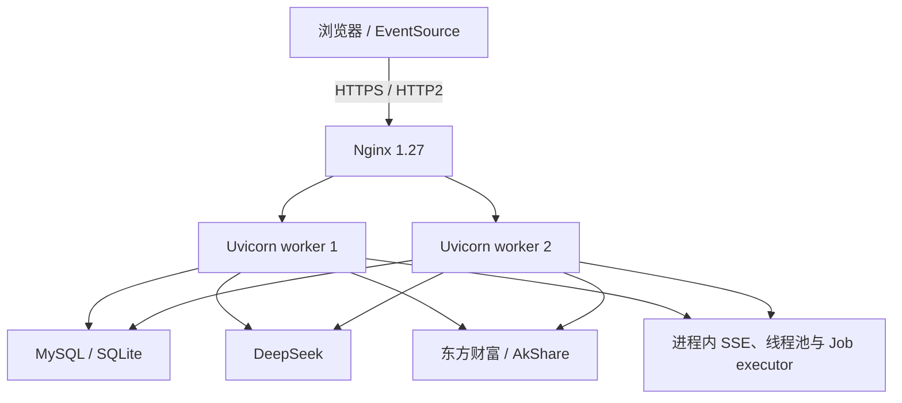

# FundPilot 性能审计归档（2026-07-23）

## 1. 归档范围与证据边界

本文件归档用户提供的 Claude Opus 4.7 只读审计结果，并把其中的实施清单整理为可追踪的工程基线。原审计明确声明“未修改代码”；后续 Codex 实施结果见 [p0_implementation_20260724.md](./p0_implementation_20260724.md)，本地前后基准见 [baseline_20260724.md](./baseline_20260724.md)。

来源文件：

| 文件 | 字节 | 行数 | SHA-256 |
| --- | ---: | ---: | --- |
| 原始提示词附件 | 17,619 | 538 | `A2A0019B0C8592E019546C7E35454876C0A0D3BE272966119FCDBFB84D9D35A6` |
| Claude 审计结果附件 | 20,015 | 177 | `5E205DC741082C4F09A91CCCF36CC891D107D544675F529778557507704483A1` |

审计结果声称另有约 359 KB、包含 86 条发现和 35 条验证详情的 `w18nvak7o.output`，但该文件未随本次任务提供，在当前 `.codex` 与项目工作区中也未找到。因此，本文件是对已提供 20,015 字节结果的忠实结构化归档，不是缺失原始产物的逐字副本。原报告中的 `file:line` 是当时快照的定位，代码变化后可能漂移。

## 2. 原审计架构判断

审计时的关键结构性问题：

1. Nginx 对全部 `/api/` 关闭缓冲、使用一小时超时，SSE 与普通 JSON 没有分治；上游连接没有显式 keepalive，静态资源也缺少 gzip/immutable 策略。
2. 认证中间件在 async dispatch 内同步查库，每个受保护请求占用事件循环。
3. SSE 用 daemon producer 线程桥接同步迭代器，但没有断连感知、协作取消或 stop event；每次分析还会创建多组临时线程池。
4. 两类异步 Job 没有活动任务去重、心跳与崩溃后 stale 清理。
5. DeepSeek 缺少单请求墙钟预算、首字节 watchdog 和对 `Retry-After` 的感知。
6. 东方财富客户端反复新建连接并显式 `Connection: close`；嵌套重试缺少统一 deadline、jitter 和 circuit breaker。
7. `StreamSession` 只存在单 worker 内存中，在两个 worker 下 follow-up 可能命中错误进程。
8. 当时没有 Redis。审计结论是 `need_now = false, need_next_stage = true`：两 worker 规模优先用 MySQL 唯一约束、MySQL session 表和进程内闸门解决，不增加新的运维失败域。

## 3. 原审计 Top 10

| 排名 | 瓶颈 | 原审计预期收益 |
| ---: | --- | --- |
| 1 | SSE 断连后 producer 最长继续工作约 10 分钟 | LLM、executor、DB 从分钟级释放缩短到秒级 |
| 2 | 单次 SSE 可现场创建约 40–60 个线程且无入口上限 | 避免少量并发就打满 anyio thread limiter |
| 3 | `sector_quote_cache` 的 any-age 读取用当前时间覆盖真实 `updated_at` | 修复 stale 被误判 fresh 的正确性问题 |
| 4 | Auth 事件循环同步查库且无 principal 缓存 | 降低事件循环阻塞与 DB RTT |
| 5 | DeepSeek 无总预算、首字节上限、429 退避语义 | 将最坏墙钟从十几分钟收敛到 90–180 秒 |
| 6 | 东方财富 HTTP 客户端每次创建并关闭连接 | 降低握手、fd 与热点 P50 |
| 7 | 东方财富调用无统一 deadline、host circuit 和 jitter | brownout 尾延迟从分钟级收敛到约 30 秒 |
| 8 | Job 无去重、heartbeat、stale recovery | 避免滚动发布后永久 running 与重复 LLM 费用 |
| 9 | StreamSession 为进程内字典 | 两 worker follow-up 从概率失败变为稳定 |
| 10 | Nginx 未拆分 SSE/JSON，JSON 与静态资源压缩/缓存不足 | 改善普通响应吞吐与传输体积 |

## 4. 数据库与缓存审计摘要

原审计列出的数据库后续候选包括：

- 收窄 immutable insert 路径的 `SELECT * FOR UPDATE`。
- decision-quality 分页由 OFFSET 改为 keyset。
- 为 pending fund transactions 增加 `(userId, status, confirm_date)` 组合索引。
- 让 `FundProfileService` 缓存跨请求复用，并按 user 隔离。
- 将逐条查询/写入改为 `IN (...)` 分批与 `executemany`。
- schema 版本命中时跳过重复幂等 DDL。
- 给 dedicated MySQL session 建立极小连接池，并给 thread-local 连接增加寿命/复用次数。
- 显式关闭 MySQL cursor。

缓存风险摘要：

- `sector_spot_cache` 的真实更新时间必须贯穿 SQLite 与内存层，stale fallback 不能重置年龄。
- 用户持仓、profile、principal 缓存必须严格按 user 隔离；多 worker 失效语义不能被本地缓存掩盖。
- OCR 与 news 表需要后续清理策略。
- 交易日历磁盘写入应原子化。
- 所有金融决策输入必须保留 PIT/no-lookahead 语义，不能用 wall-clock `cached_at` 冒充决策时点。

## 5. 原审计并发预算建议

| 资源 | 第一阶段建议 |
| --- | --- |
| Uvicorn | 保持 2 worker，先暴露并收敛内部并发预算 |
| SSE | 每 worker 最多 4 条，超限返回 `429` 和 `Retry-After` |
| 东方财富连接池 | `max_connections=32`、`max_keepalive_connections=16`、keepalive expiry 30 秒 |
| 东方财富供应商闸门 | 每进程 8–10 个并发 |
| DeepSeek | 单请求预算 90–180 秒 |
| Job | 2 worker，等待队列上限 8 |
| AkShare | 后续 P2 再考虑 2–4 个长驻子进程 |
| MySQL | 后续增加连接寿命与 reuse 限制；dedicated pool 最大 2 |

## 6. 分批清单

### P0：低风险、高收益

| ID | 原审计项目 |
| --- | --- |
| P0-01 | 修复 sector quote cache 的更新时间语义 |
| P0-02 | SSE 接入断连检查、stop event 与协作取消 |
| P0-03 | AuthPrincipal TTL cache 与 `to_thread` |
| P0-04 | DeepSeek 总预算、首字节 watchdog、429 `Retry-After` |
| P0-05 | 东方财富共享 Client/Session，移除 `Connection: close` |
| P0-06 | Job dedup、heartbeat、stale cleanup |
| P0-07 | 东方财富 deadline、host circuit、jitter |
| P0-08 | Nginx 拆分 SSE/JSON，启用 gzip 与 upstream keepalive |
| P0-09 | SSE 入口 semaphore 与 `429 Retry-After` |
| P0-10 | StreamSession sticky routing 或 MySQL 持久化 |

### P1：缓存与数据库治理

1. MySQL thread-local 连接增加 max lifetime 与 reuse count。
2. 收窄 `SELECT * FOR UPDATE`。
3. `FundProfileService` 单例化与按用户 TTL。
4. decision-quality OFFSET 改 keyset。
5. Job 元数据锁单飞化。
6. dedicated session 小型连接池。
7. `_execute` 显式关闭 cursor。
8. 批量任务 N+1 收敛。
9. pending transaction 组合索引。
10. lifespan bootstrap 后台化与 readiness gate。

### P2：并发与容量

1. SSE fan-out 统一到共享业务 executor。
2. executor 任务传播 stop event。
3. AkShare 长驻子进程池。
4. 东方财富 fallback 并行 race。
5. 缓存 TTL jitter 与跨 worker singleflight。
6. Dashboard 非交易时段轮询降档及聚合端点。
7. Chat/报告请求接入前端并发去重。
8. `apiFetch` 全局超时与 `AbortController`。
9. 静态/半静态 API 的 Cache-Control/ETag。
10. 静态资源 immutable。

## 7. 原审计验收与风险边界

原建议验收条件包括：

- SSE 断连后 producer 在 5 秒内退出。
- DeepSeek P99 小于 180 秒。
- 重复 Job 提交只产生一条活动记录。
- JSON 端点启用 gzip，SSE 不缓冲。
- 两 worker 下 StreamSession follow-up 稳定命中。
- schema 变更只增列/增表/增索引，不做 DROP。

必须保留的业务边界：

- 金融数据 stale 或 identity 不确定时应 fail-closed，不能静默变成新鲜、精确或可执行证据。
- 认证禁用、密码变更、角色变化和 `authVersion` 递增应即时生效。
- 用户数据隔离优先于缓存命中率。
- SSE/DeepSeek 取消需要同时覆盖正常完成与中途断连。
- Nginx 配置上线前必须在目标镜像执行 `nginx -t`，再热重载和烟测。

## 8. 容量判断

原审计建议短期维持单机 2 worker，并先完成 P0；只有出现以下条件时再重新评估 Redis：

- 扩到至少 4 worker 或跨机器部署。
- provider circuit breaker 需要跨进程共享。
- Auth/profile 缓存一致性已经成为可观察瓶颈。
- MySQL StreamSession 持续超过约 50 req/s 并形成热点。
- MySQL 去重与进程内 semaphore 已证明确实到达瓶颈。

尚未覆盖的长期项包括 Prometheus/OpenTelemetry、生产 SLO 历史、端点/用户级 LLM 费用归因和真实生产容量验证。
